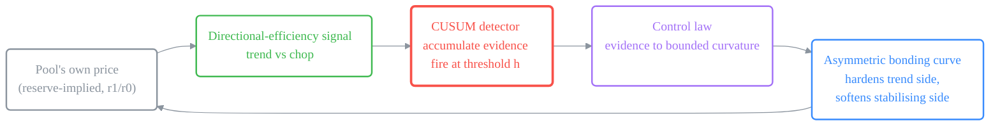
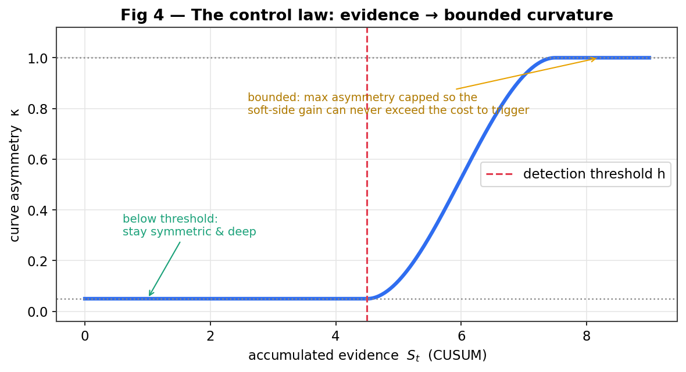
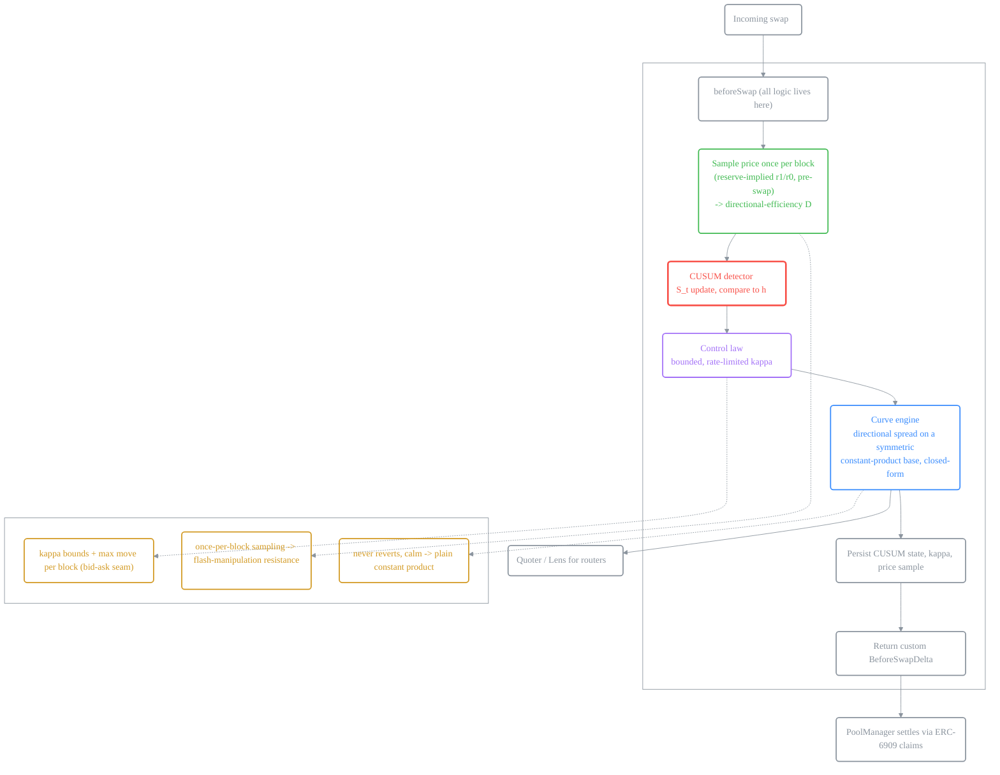
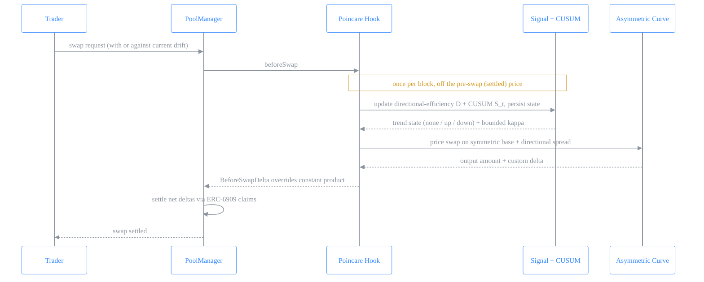
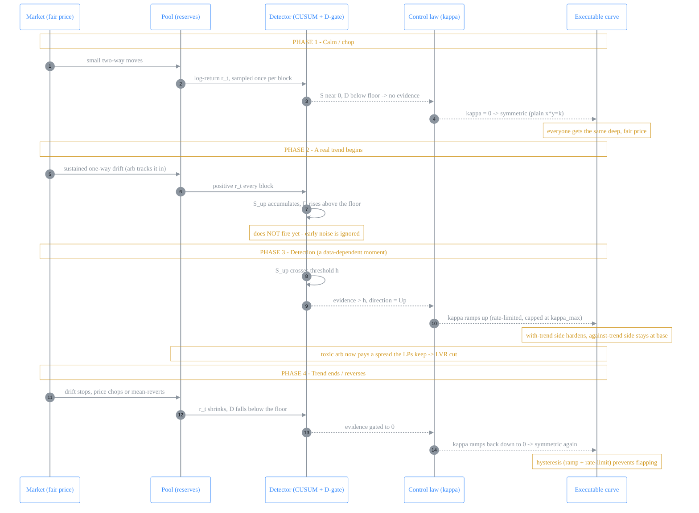
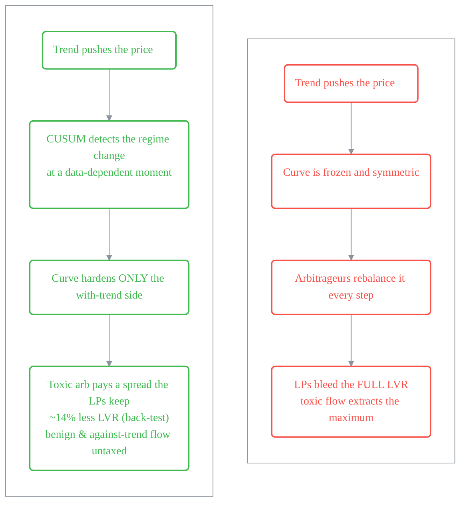
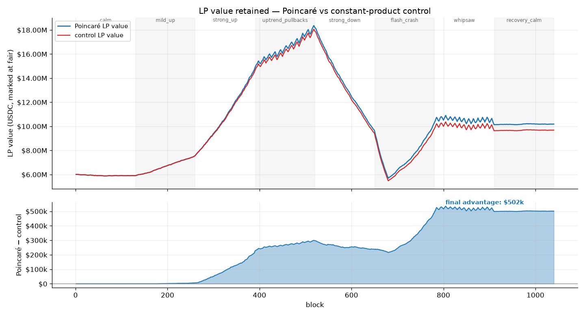
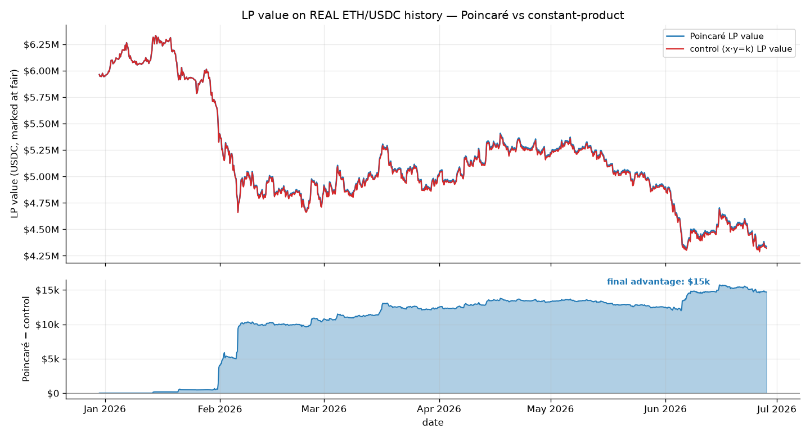

# POINCARÉ

### An adaptive Uniswap v4 AMM that detects real price trends with a provably-optimal change-detector and leans its bonding curve against them, protecting liquidity providers from the losses that trends cause, without an oracle.

---

## TL;DR

A normal AMM is a frozen curve: it quotes the same way whether the market is drifting hard in one direction (when liquidity providers bleed value to arbitrageurs) or just chopping around harmlessly. Poincaré watches its own price, runs a **CUSUM quickest-change detector** to decide, with mathematically optimal speed, whether a *genuine* directional trend has begun, and when one has, it **bends its bonding curve asymmetrically**: it hardens the side the trend is pushing (where LPs lose money) and stays cheap and open on the stabilising side (rewarding the flow that helps).

The detector fires at a **data-dependent moment**, not after a fixed number of blocks, so there is no countdown for an attacker to game. And because the only way to fool the detector is to *genuinely move the market* (spending real money and feeding arbitrageurs), manipulation is bounded by design, not wished away.

**What it uses:** the *Milionis LVR identity* (why curvature is the lever), an *asymmetric hyperbolic bonding curve* (the actuator, shipped as an arb-safe directional spread; see §3.1), a *directional-efficiency signal*, and *CUSUM / Quickest Change Detection* with *Lorden minimax optimality* (the engine), with *robust-QCD* hardening on the roadmap.

---

## 1. The problem

Liquidity providers lose value to better-informed flow whenever the price moves, a cost with a precise name, **Loss-Versus-Rebalancing (LVR)**. The Milionis–Moallemi–Roughgarden–Zhang identity pins it down:

$$\text{LVR rate} \;\approx\; \tfrac{1}{2}\,\sigma^2 \cdot \big(\text{marginal liquidity}\big)$$

Two truths fall out of that one line:

- **Curvature is the lever.** "Marginal liquidity" is a property of the curve's *shape*. A flat curve bleeds more LVR; a sharp curve bleeds less. The *fee* is not in this equation, so fee-tweaking, which most hooks do, is pulling the wrong lever.
- **The damage is directional.** LVR is driven by *sustained, one-directional* price moves, not by symmetric noise. A market that thrashes around but goes nowhere barely hurts LPs; a market that *trends* is what drains them.

So the right response is: **reshape the curve's curvature, asymmetrically, but only when a real trend is actually happening.** That last clause is the hard part, and the whole project.

---

## 2. The design in one picture

Poincaré has two parts: a **detector** (the brain) that decides *when* there is a real trend, and an **actuator** (the curve) that *acts* on that decision.

The novelty is the **detector**: no AMM in the Uniswap hook ecosystem uses change-point detection. The asymmetric curve is just where its decision lands.

---

## 3. The mathematics we use

### 3.1 The actuator: an asymmetric hyperbolic curve

A constant-product pool is the hyperbola `x·y = k`. The natural way to make it *asymmetric* is to generalise it with **direction-dependent virtual offsets**: small offsets for the with-trend side (a steep, shallow curve, heavy impact) and large offsets for the stabilising side (a flat, deep curve):

$$\big(x + a_{\pm}\big)\big(y + b_{\pm}\big) = K$$

This is the design the figure below illustrates, and it is where we started.

> **Why we did *not* ship raw direction-dependent offsets, and what we ship instead.**
> Choosing *different depths* per swap direction and re-anchoring at the current reserves on every swap is **arbitrage-exploitable**. We reproduced it as a concrete round-trip drain: buy on the shallow branch, sell back on the deep branch, and walk away with pool value. The root cause is that depth-asymmetry shifts the **mid-price**, not just the spread, which opens a free round trip, a hole an MEV bot empties on day one.
>
> The fix, and what the MVP actually implements, is to put the asymmetry **in the slope, not the depth**: a **non-negative directional spread** layered on a *single, symmetric* base curve. The with-trend (toxic) side is charged a spread `κ` the LP keeps; the against-trend (stabilising) side trades at the base price. Because the spread only ever *worsens* the trader's execution and sits on a symmetric base, **every round trip is strictly unprofitable by construction** (proven by fuzzing and a 384k-op invariant), yet the two executable branches still meet at the current price, giving the **endogenous bid–ask spread written into the geometry** that a professional market maker maintains. The richer depth/curvature lever stays on the roadmap, gated on the manipulation-cost sizing it would require (§3.4, §7).

*Fig 1. Conceptual view. In calm markets the curve is symmetric and deep (grey). When a real up-trend is detected, the executable price hardens on the trend-following side (red) and stays at the base on the counter-trend side (green). The kink at the operating point is a real, dynamic bid–ask spread, and in the shipped MVP that kink is the directional **spread**, not a depth change.*

### 3.2 The signal: directional efficiency

We measure how *trending* the recent path is with a directional-efficiency ratio (a cheap, on-chain proxy for the Hurst exponent):

$$D \;=\; \frac{\big|\,P_{\text{now}} - P_{\text{window start}}\,\big|}{\sum_i \big|\,P_i - P_{i-1}\,\big|} \;\in\; [0,1]$$

Near **1** the price marched one way (trend); near **0** it moved a lot but went nowhere (chop). This feeds the detector.

### 3.3 The engine: CUSUM / Quickest Change Detection

This is the heart. The question "has a *real* regime change (a trend) started, and how fast can I be sure without crying wolf on noise?" is the mathematics of **Quickest Change Detection**, and its optimal workhorse is the **CUSUM** statistic (Page, 1954). It recursively accumulates the evidence and fires when it crosses a threshold:

$$S_t \;=\; \max\!\big(0,\; S_{t-1} + (\ell_t - k)\big), \qquad \text{alarm when } S_t \ge h$$

where `ℓ_t` is the per-step increment, `k` is a slack constant, and `h` is the only real knob, set by the tolerable **false-alarm rate**, *not* by a hard-coded number of blocks. The MVP uses the **Gaussian-form increment** `ℓ_t = r_t` (the signed log-return), the standard CUSUM workhorse; the heavy-tailed **log-likelihood-ratio** variant is the §3.4 roadmap item.

Why this is the right tool, and not a heuristic:

- **The firing moment is a *stopping time*: data-dependent and unpredictable.** A strong, real trend crosses `h` fast; weak noise never does. There is no fixed "after N blocks" for an attacker to exploit.
- **It is provably optimal.** CUSUM is asymptotically optimal under **Lorden's minimax criterion**: it minimises the worst-case delay to detect a true change for any given false-alarm rate. That is the best-possible resolution of the "react fast vs don't get fooled" tension.

### 3.4 The hardening: robust / minimax QCD *(roadmap)*

The attacker who tries to fool the detector is itself a studied problem. **Minimax-robust QCD** designs the test against worst-case (least-favourable) distributions, and the **covert-adversary-vs-CUSUM** results let us *quantify* how costly it is to delay or trigger the detector.

**What the MVP actually relies on for manipulation resistance** is not the robust increment (that is the heavy-tailed roadmap upgrade) but three concrete, *implemented* layers, proven in the test-suite (§4.2, §4.4): (1) the **data-dependent firing time** removes any countdown to game; (2) the **bounded, one-sided spread** means the soft side trades at the base price, so faking a trend yields **zero** extractable advantage on the other side (`max_soft_gain ≡ 0`); and (3) **arbitrage** makes genuinely moving the price costly (`min_trigger_cost > 0`). The robust-QCD increment hardens layer (1) further against heavy-tailed crypto returns and is the next detector upgrade; see **§9.2** for the self-normalizing, self-calibrating **v2** that builds on it (thresholds expressed in units of the live volatility σ, so they adapt to the market automatically).

### 3.5 The control law: evidence to bounded curvature

The detector's accumulated evidence sets the curve's asymmetry, **bounded** so it can never swing far enough to be worth gaming:

$$\kappa \;=\; \text{clamp}\big(f(S_t),\; \kappa_{\min},\; \kappa_{\max}\big)$$

*Fig 4. Below the detection threshold the curve stays symmetric and deep. Past it, asymmetry ramps up but is hard-capped, so the most an attacker could ever gain on the soft side is smaller than the cost of triggering the detector.*

---

## 4. How it works: the full lifecycle

### 4.1 Architecture

### 4.2 A swap, step by step

### 4.3 Lifecycle on a *real* trend

A pool is deployed with the hook. Swaps begin. While the market only chops, the directional-efficiency signal stays low, the CUSUM statistic hovers near zero, and **the curve stays symmetric and deep, best-in-class execution for everyone.** Then a genuine trend begins. The CUSUM statistic starts climbing as evidence accumulates; it does *not* fire on the first few trades (that would be crying wolf). Only when the evidence crosses the threshold (a moment that depends on how strong the trend is, not on a fixed clock) does the regime flip and the curve begin to lean against the trend.

*Fig 2. Top: the pool price, calm then trending. Middle: the CUSUM statistic accumulating evidence and crossing the threshold at a data-dependent moment. Bottom: the curve's asymmetry, flat until detection, then ramping up to lean against the trend. Notice the detector ignores the early noise and only commits when the evidence is real.*

### 4.4 What happens when someone fakes a trend

This is the crux, and the figure makes it concrete. To push the CUSUM statistic to its threshold, an attacker cannot simply *signal* a trend; they must **actually move the price**, with real buys and real money. But moving the price away from fair value opens an arbitrage gap, and arbitrageurs immediately trade against them, capping the move and snapping it back the moment the attacker stops. So the attacker's cost climbs the whole time, and the unwind hands their losses straight to the arbitrageurs.

*Fig 3. Top: the attacker genuinely pumps the price (real money), and arbitrageurs snap it back when they stop. Middle: the CUSUM does cross, but only because the price truly moved, which the attacker paid for. Bottom: the attacker's mounting cost. The "fake" trend was never fake; it was a real, expensive market move. Combined with the bounded asymmetry (Fig 4), the soft-side advantage they could capture is held below this cost, so the attack does not pay.*

The defence is therefore three layers working together: the **data-dependent CUSUM** removes the predictable countdown, the **bounded asymmetry** caps the prize, and **natural arbitrage** punishes anyone who tries to manufacture the move.

### 4.5 The full lifecycle, and how it differs from a normal pool

This is the heart of the novelty in one picture: one pool walked through an entire regime cycle (calm, a real trend, detection, the lean, and the return to calm), showing exactly *when* and *why* the curve changes.

**Side by side, on the very same trend**, against a normal constant-product pool:

A normal pool cannot tell a trend from chop, so it offers the same terms to toxic and benign flow alike and pays the full LVR. Poincaré spends a small, bounded spread *only* on the flow that is actually hurting LPs, *only* while a real trend is confirmed, and routes it back to the LPs.

---

## 5. Why it benefits everyone

- **Liquidity providers** keep the value that normally leaks to arbitrageurs during trends, *and*, unlike a symmetric defence, keep their fee volume, because only the toxic side is hardened while the benign side stays open.
- **Traders** stabilising the pool (trading against the drift) trade at the **full base price with no spread**: they are never charged for the trend, while toxic with-trend flow is; ordinary traders in calm markets see the symmetric base curve.
- **Routers / aggregators** prefer it for exactly that reason (better execution on the flow it welcomes), and a first-class Quoter/Lens makes the custom curve easy to integrate.

It does not make liquidity provision risk-free: the LP still holds the assets and feels genuine market moves. It removes the *avoidable* arbitrageur tax (the LVR), not the underlying exposure.

---

## 6. Scope and honest restrictions

- **Two-asset pairs**, and it is built for **volatile, free-floating pairs** (ETH/USDC, ETH/BTC, volatile majors) where directional LVR dominates.
- **Calm and pegged pairs are handled gracefully**: low signal keeps the curve symmetric with the spread at zero (plain constant-product execution for everyone); a sudden depeg is just a detected trend the curve leans into. (A deep, stableswap-like *base* curve is a roadmap option, since the curve engine already supports virtual offsets; the MVP uses a constant-product base.)
- **Liquidity- and flow-sensitive.** Deployable on long-tail pools, safest where there is real depth and a clean price series for the detector.
- The detector raises and *bounds* the cost of manipulation; it does not claim to make it impossible. The manipulation-cost analysis is a first-class deliverable, not a footnote.

---

## 7. Why this is not a copy

The asymmetric-curve idea alone would resemble the directional-fee family (Nezlobin and its descendants). What makes Poincaré a different object is the **engine**: a **Quickest-Change-Detection trend detector** governs *when* it acts. A scan of the entire 562-hook UHI directory and the UHI9 winners returns **zero** uses of CUSUM, change-point detection, SPRT, or quickest detection; the signals in use are simple EWMAs, TWAPs, and imbalance thresholds with fixed cut-offs, precisely what an attacker can game. Poincaré is, to our knowledge, the **first AMM whose regime-switching is governed by a provably-optimal sequential change detector, firing at a data-dependent moment no attacker can precompute.** The curve is the actuator; the detector is the contribution.

| Axis | Existing hooks | **Poincaré** |
|---|---|---|
| Lever | fee / spread / static curve | **asymmetric geometry: a directional, trend-gated spread (arb-safe); depth/curvature lever on the roadmap** |
| Trigger | fixed window / threshold / oracle | **CUSUM stopping time (data-dependent)** |
| Optimality | heuristic | **Lorden minimax-optimal detection** |
| Manipulation | hopes the signal is hard to fake | **bounded prize (soft-gain ≡ 0) + arbitrage punishment; robust-QCD on the roadmap** |
| External deps | oracle / AVS / keeper | **none, self-contained** |

---

## 8. Integration: routing and best-fit pairs

**Will routers find it, and will they pick it?** A Poincaré pool is a normal Uniswap v4 pool from the `PoolManager`'s point of view, discoverable like any other. The one subtlety every custom-curve hook shares: the **vanilla v4 Quoter cannot price it**, because it assumes the canonical `x·y=k` math and would mis-quote our curve. That is exactly what the first-class **`PoincareLens`** is for: it prices off the *same* libraries the swap path uses, so any router or aggregator that quotes through the Lens (or simulates the swap) gets the correct number. Integration therefore means "quote via the Lens," not "trust the default quoter."

Given correct quotes, selection is a **feature of the design, not a hope**:

- For **calm-market and against-trend (stabilising) flow**, Poincaré quotes the *full base price with no spread*, competitive with, and often better than, a pool charging a static or vol-scaled fee. Best-execution routers will pick it for exactly this flow.
- For **with-trend (toxic) flow during a confirmed trend**, Poincaré deliberately quotes *worse* (the spread). Routers send that flow elsewhere, which is the point: the pool sheds the flow that costs LPs money and keeps the flow that doesn't.

So the routing dynamics are self-selecting: Poincaré wins the benign/stabilising order flow and declines the toxic flow, which is precisely the LP-favourable split.

**Which pairs does it work best for?**

- **Best:** liquid, free-floating, **volatile majors with real trend episodes amid calm**: ETH/USDC, ETH/BTC, major L1/L2 tokens vs a stable. This is where directional **LVR dominates**, where the detector has a clean, deep price series, and where genuine manipulation is expensive, the exact regime the back-test models.
- **Graceful but low-upside:** tightly **pegged stables** (USDC/USDT). Little directional LVR to recover, so the curve simply stays symmetric and cheap; a depeg is just a detected trend it leans into.
- **Weakest fit:** **thin / long-tail** pools: a noisy price makes detection less reliable and makes the price cheaper to move, which raises the (still-bounded) manipulation surface. Deploy here only with conservative `k, h, κ_max`.

The single most important property for a good fit is a **deep, clean, free-floating price series with occasional real trends**, the conditions under which a quickest-change detector is both useful and safe.

## 9. Proof: a WETH/USDC stress simulation on a Sepolia v4 fork

Beyond the in-memory back-test, the hook was run **end-to-end against the real Uniswap v4
`PoolManager` deployed on Sepolia** (forked locally). Two pools are deployed on that real
PoolManager, seeded identically and fed the **same** fair-price path and the **same** order flow,
differing in one parameter only:

- **POINCARÉ:** the hook with the detector + 5% directional-spread cap live;
- **CONTROL:** the *same hook* with `κ_max = 0`, i.e. a pure constant-product `x·y=k` AMM.

The control is therefore a true apples-to-apples baseline: any difference is attributable solely
to the Poincaré asymmetry. Each block an arbitrageur drags both pools toward fair (the LVR
channel) and an identical uninformed order hits both; every swap is logged. The run spans **8
stress regimes** (calm, trends, a flash crash, whipsaw) over **1,040 blocks / 3,842 real swaps**.

| metric | POINCARÉ | CONTROL | result |
|---|---:|---:|---|
| Cumulative LVR (arbitrageur extraction) | 155,443 USDC | 221,227 USDC | **−29.7%** |
| **LP value retained** (marked at fair) | **10,186,959 USDC** | 9,685,443 USDC | **+$501,516** |

The LP-value advantage is **flat in calm** (the detector correctly does not engage, nothing to
protect), **grows through the trends**, and **jumps during the flash-crash + whipsaw**, where Poincaré
helps most in exactly the high-LVR regimes (strong_up **−54%**, flash_crash **−83%**) where LPs
bleed the most. Full methodology, per-scenario breakdown, the two order books, and honest caveats:
[`analysis/simulation/SIMULATION.md`](analysis/simulation/SIMULATION.md). Reproduce with
`FOUNDRY_PROFILE=sim forge test --match-path test/sim/ForkSimulation.t.sol` then
`python analysis/simulation/plot.py`.

### 9.1 Against real market data: 6 months of ETH/USDC

The same comparison, but driven by **real Binance ETHUSDC 4h closes** (2025-12-30 → 2026-06-28,
1,080 candles) instead of a synthetic path. Over this window ETH fell **$2,987 → $1,568** (≈ −47%,
a genuine multi-leg bear market with rallies).

| metric | POINCARÉ | CONTROL | result |
|---|---:|---:|---|
| Cumulative LVR | 104,721 USDC | 114,807 USDC | **−8.8%** |
| **Final LP value advantage** | | | **+$14,697** |

The advantage is **flat through choppy January, jumps at the February crash, and jumps again at the
June leg-down**, as the detector engaged on the two real sustained downtrends and stayed neutral in
chop. The reduction (8.8%) is smaller than on the synthetic stress path (29.7%) precisely because
real markets are noisier with fewer clean trends, so the conservative detector helps less, **but it
never hurts** (LVR ≤ control throughout, asserted). With params merely sensible-not-optimised for
4h ETH; pair-specific calibration would raise the captured fraction. Reproduce:
`python analysis/simulation/fetch_realdata.py` →
`FOUNDRY_PROFILE=sim forge test --match-path test/sim/ForkRealData.t.sol` →
`python analysis/simulation/plot_realdata.py`.

### 9.2 v2: a self-normalizing, self-calibrating detector

That last sentence ("calibration would raise the captured fraction") points straight at the most
promising upgrade. In the shipped MVP the detector parameters (`k` slack, `h` threshold, …) are
**fixed at deploy**: calibrated, but static, so a structural change in the pair's volatility
eventually makes them stale. The **v2 variant** makes the *detection* thresholds **adapt to the
market automatically**, with no governance and no parameter writes:

- Express the slack and threshold in **units of the running volatility σ** rather than in absolute
  log-return units (e.g. `k ≈ 0.5σ`, `h ≈ 5σ`) and feed the CUSUM the **standardized increment**
  `r_t / σ_t`. This is the textbook *standardized / adaptive CUSUM*.
- Crucially, **σ is already computed on-chain**: `DirectionalSignal.ewmaTV` is an
  exponentially-weighted total-variation accumulator, a live volatility estimate sitting right in
  the detector. So the thresholds **breathe with the market** (tighten in calm, widen in
  turbulence) essentially for free, and the detector becomes scale-free across pairs and regimes.
  It is a natural generalization of the robust-increment item (§3.4).
- **Security parameters stay fixed by design.** `κ_max` (the manipulation-prize cap) and `Δκ_max`
  (the bid-ask-seam rate-limit) must **not** drift with data, or an attacker could move the very
  bounds that protect LPs. The clean split is: **detection params (`k`, `h`) adapt via σ; security
  params stay constant.**

The honest cost of admission: letting data drive the parameters opens a **second-order
manipulation channel** (inflate σ to blind the detector, or suppress it to make it trigger-happy),
so v2 needs its **own manipulation-cost bound** re-derived, using the same robust/minimax-QCD discipline
flagged in §3.4 and §7. Our existing guards (once-per-block sampling, bounded κ, arbitrage cost)
carry over and help, but the bound must be re-established before v2 ships. It is a well-understood
next step, not a redesign, and the back-test + real-data harness above is exactly the tool to
validate it.

## 10. Roadmap

> **Status:** the MVP described above is **built and green**, 91 passing Foundry tests (unit, fuzz, invariant/solvency over 384k ops, end-to-end manipulation sims, gas). The items below are what remains to go from MVP to production.

**Built (MVP):** the asymmetric curve engine + `beforeSwapReturnDelta` accounting; the directional-efficiency signal and two-sided CUSUM detector (`h` from a target false-alarm rate, not a block count); the bounded, rate-limited control law + safety layer; the back-test (LVR vs constant-product **and** vs a vol-fee baseline, plus the manipulation-cost study); the Quoter/Lens; and the full Foundry suite (fuzz, invariant/solvency, end-to-end manipulation sims, gas).

**Next, to production:**

1. **Real-data calibration:** replay a historical series for the target pair to pin `k, h (ARL₀), window, κ_max`; the engine is already data-ready.
2. **v2 self-calibrating detector (§9.2):** express `k, h` in units of the running volatility σ
   (already tracked on-chain via `DirectionalSignal.ewmaTV`) so the detection thresholds adapt to
   the market automatically, with no governance; fold in the robust / heavy-tailed increment (§3.4)
   for crypto's fat tails. Security params (`κ_max, Δκ_max`) stay fixed; needs its own
   manipulation-cost bound before shipping.
3. **Depth / curvature lever** (the §3.1 offset design), *only* once the manipulation-cost sizing that keeps it arb-safe is derived; the spread lever ships first because it is safe by construction.
4. **Deep, stableswap-like base curve** option (the engine already supports virtual offsets).
5. **Router / aggregator integration** through the Lens, plus native-ETH and multi-pool coverage.
6. **External security audit** before mainnet.
