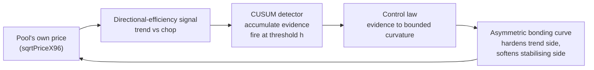
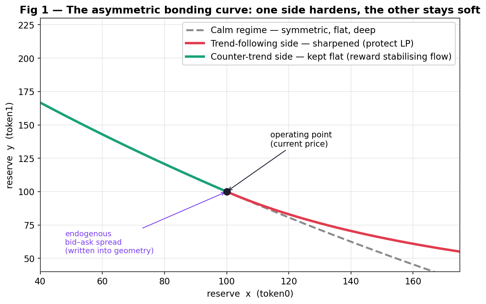
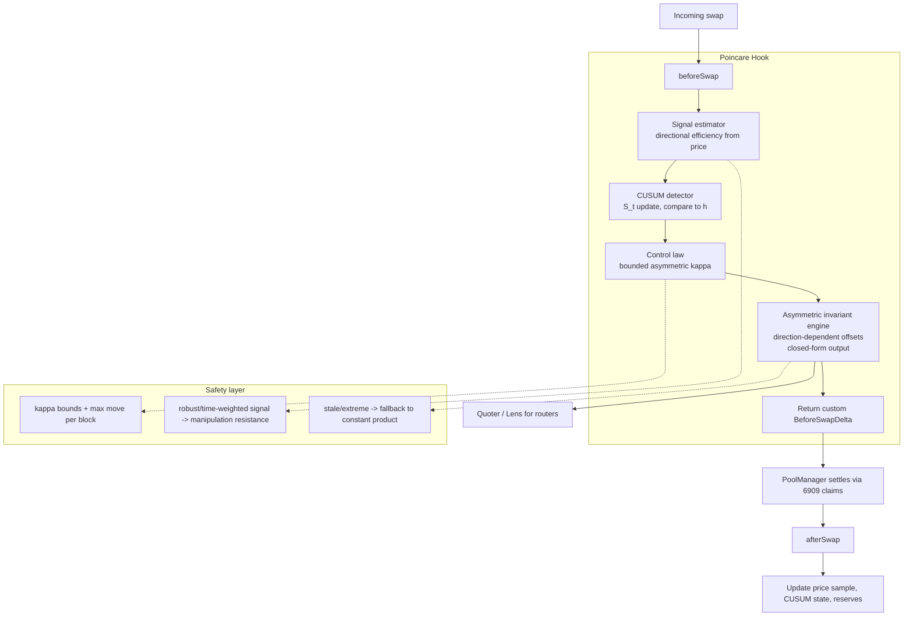
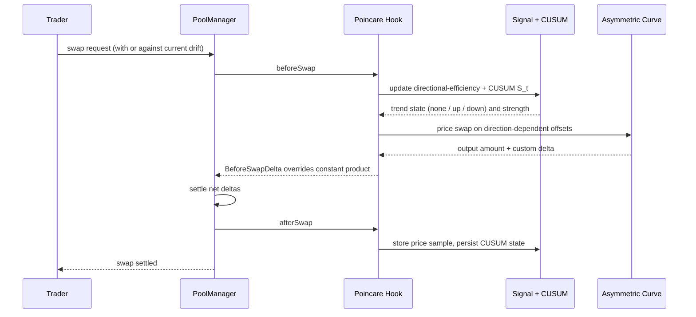
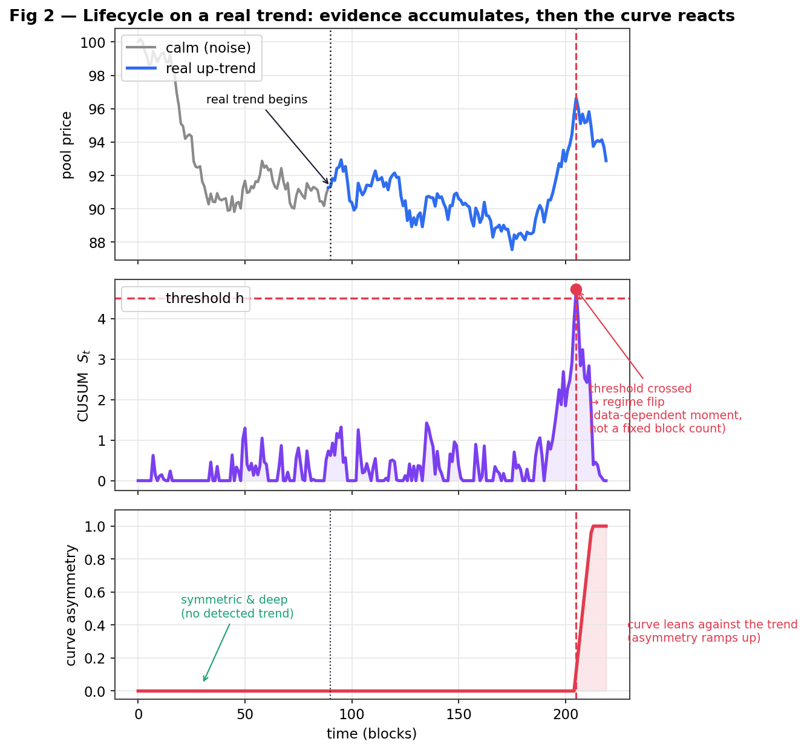
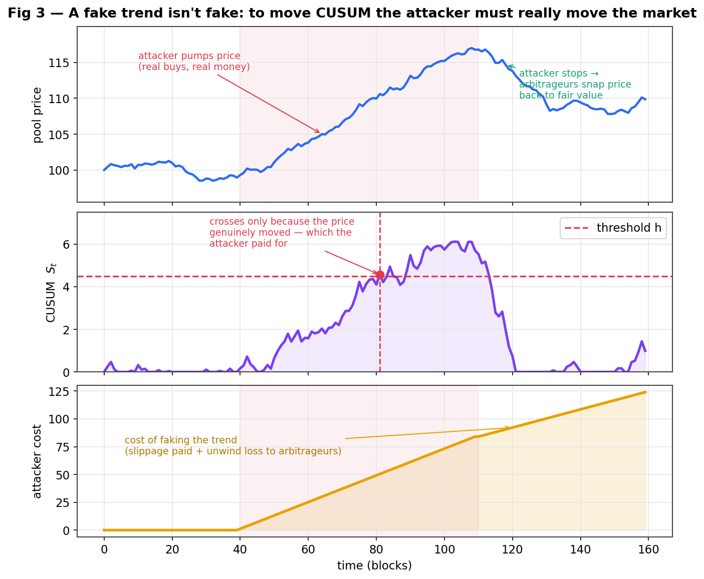

# POINCARÉ

### An adaptive Uniswap v4 AMM that detects real price trends with a provably-optimal change-detector and leans its bonding curve against them — protecting liquidity providers from the losses that trends cause, without an oracle.

> *Working codename — rename freely.*

---

## TL;DR

A normal AMM is a frozen curve: it quotes the same way whether the market is drifting hard in one direction (when liquidity providers bleed value to arbitrageurs) or just chopping around harmlessly. Poincaré watches its own price, runs a **CUSUM quickest-change detector** to decide — with mathematically optimal speed — whether a *genuine* directional trend has begun, and when one has, it **bends its bonding curve asymmetrically**: it hardens the side the trend is pushing (where LPs lose money) and stays deep and cheap on the stabilising side (rewarding the flow that helps).

The detector fires at a **data-dependent moment**, not after a fixed number of blocks, so there is no countdown for an attacker to game. And because the only way to fool the detector is to *genuinely move the market* — spending real money and feeding arbitrageurs — manipulation is bounded by design, not wished away.

**What it uses:** the *Milionis LVR identity* (why curvature is the lever), an *asymmetric hyperbolic bonding curve* (the actuator), a *directional-efficiency signal*, and *CUSUM / Quickest Change Detection* with *Lorden minimax optimality* and *robust-QCD* hardening (the engine).

---

## 1. The problem

Liquidity providers lose value to better-informed flow whenever the price moves — a cost with a precise name, **Loss-Versus-Rebalancing (LVR)**. The Milionis–Moallemi–Roughgarden–Zhang identity pins it down:

$$\text{LVR rate} \;\approx\; \tfrac{1}{2}\,\sigma^2 \cdot \big(\text{marginal liquidity}\big)$$

Two truths fall out of that one line:

- **Curvature is the lever.** "Marginal liquidity" is a property of the curve's *shape*. A flat curve bleeds more LVR; a sharp curve bleeds less. The *fee* is not in this equation — so fee-tweaking, which most hooks do, is pulling the wrong lever.
- **The damage is directional.** LVR is driven by *sustained, one-directional* price moves, not by symmetric noise. A market that thrashes around but goes nowhere barely hurts LPs; a market that *trends* is what drains them.

So the right response is: **reshape the curve's curvature, asymmetrically, but only when a real trend is actually happening.** That last clause is the hard part — and the whole project.

---

## 2. The design in one picture

Poincaré has two parts: a **detector** (the brain) that decides *when* there is a real trend, and an **actuator** (the curve) that *acts* on that decision.

The novelty is the **detector**: no AMM in the Uniswap hook ecosystem uses change-point detection. The asymmetric curve is just where its decision lands.

---

## 3. The mathematics we use

### 3.1 The actuator — an asymmetric hyperbolic curve

A constant-product pool is the hyperbola `x·y = k`. We generalise it with virtual offsets and, crucially, make those offsets **direction-dependent**:

$$\big(x + a_{\pm}\big)\big(y + b_{\pm}\big) = K$$

The offsets used for a swap pushing *with* the trend (`+`) differ from those used for a swap pushing *against* it (`−`). The trend-following side gets small offsets (a **steep, shallow** curve — heavy price impact, protecting LPs). The stabilising side keeps large offsets (a **flat, deep** curve — cheap execution, rewarding the helpful flow). The two branches meet at the current price, creating an **endogenous bid–ask spread written into the geometry itself** — exactly what a professional market maker maintains, and what no AMM has natively.

*Fig 1 — In calm markets the curve is symmetric and deep (grey). When a real up-trend is detected, the curve hardens on the trend-following side (red) and stays flat on the counter-trend side (green). The kink at the operating point is a real, dynamic bid–ask spread.*

### 3.2 The signal — directional efficiency

We measure how *trending* the recent path is with a directional-efficiency ratio (a cheap, on-chain proxy for the Hurst exponent):

$$D \;=\; \frac{\big|\,P_{\text{now}} - P_{\text{window start}}\,\big|}{\sum_i \big|\,P_i - P_{i-1}\,\big|} \;\in\; [0,1]$$

Near **1** the price marched one way (trend); near **0** it moved a lot but went nowhere (chop). This feeds the detector.

### 3.3 The engine — CUSUM / Quickest Change Detection

This is the heart. The question "has a *real* regime change (a trend) started, and how fast can I be sure without crying wolf on noise?" is the mathematics of **Quickest Change Detection**, and its optimal workhorse is the **CUSUM** statistic (Page, 1954). It recursively accumulates the evidence and fires when it crosses a threshold:

$$S_t \;=\; \max\!\big(0,\; S_{t-1} + (\ell_t - k)\big), \qquad \text{alarm when } S_t \ge h$$

where `ℓ_t` is the log-likelihood-ratio increment of "trend" vs "no-trend," `k` is a slack constant, and `h` is the only real knob — and it is set by the tolerable **false-alarm rate**, *not* by a hard-coded number of blocks.

Why this is the right tool, and not a heuristic:

- **The firing moment is a *stopping time* — data-dependent and unpredictable.** A strong, real trend crosses `h` fast; weak noise never does. There is no fixed "after N blocks" for an attacker to exploit.
- **It is provably optimal.** CUSUM is asymptotically optimal under **Lorden's minimax criterion**: it minimises the worst-case delay to detect a true change for any given false-alarm rate. That is the best-possible resolution of the "react fast vs don't get fooled" tension.

### 3.4 The hardening — robust / minimax QCD

The attacker who tries to fool the detector is itself a studied problem. **Minimax-robust QCD** designs the test against worst-case (least-favourable) distributions, and the **covert-adversary-vs-CUSUM** and game-theoretic-attack results let us *quantify* how costly it is to delay or trigger the detector. That body of work becomes Poincaré's manipulation-resistance proof — see §4.2.

### 3.5 The control law — evidence to bounded curvature

The detector's accumulated evidence sets the curve's asymmetry, **bounded** so it can never swing far enough to be worth gaming:

$$\kappa \;=\; \text{clamp}\big(f(S_t),\; \kappa_{\min},\; \kappa_{\max}\big)$$

*Fig 4 — Below the detection threshold the curve stays symmetric and deep. Past it, asymmetry ramps up but is hard-capped, so the most an attacker could ever gain on the soft side is smaller than the cost of triggering the detector.*

---

## 4. How it works — the full lifecycle

### 4.1 Architecture

### 4.2 A swap, step by step

### 4.3 Lifecycle on a *real* trend

A pool is deployed with the hook. Swaps begin. While the market only chops, the directional-efficiency signal stays low, the CUSUM statistic hovers near zero, and **the curve stays symmetric and deep — best-in-class execution for everyone.** Then a genuine trend begins. The CUSUM statistic starts climbing as evidence accumulates; it does *not* fire on the first few trades (that would be crying wolf). Only when the evidence crosses the threshold — a moment that depends on how strong the trend is, not on a fixed clock — does the regime flip and the curve begin to lean against the trend.

*Fig 2 — Top: the pool price, calm then trending. Middle: the CUSUM statistic accumulating evidence and crossing the threshold at a data-dependent moment. Bottom: the curve's asymmetry, flat until detection, then ramping up to lean against the trend. Notice the detector ignores the early noise and only commits when the evidence is real.*

### 4.4 What happens when someone fakes a trend

This is the crux, and the figure makes it concrete. To push the CUSUM statistic to its threshold, an attacker cannot simply *signal* a trend — they must **actually move the price**, with real buys and real money. But moving the price away from fair value opens an arbitrage gap, and arbitrageurs immediately trade against them, capping the move and snapping it back the moment the attacker stops. So the attacker's cost climbs the whole time, and the unwind hands their losses straight to the arbitrageurs.

*Fig 3 — Top: the attacker genuinely pumps the price (real money), and arbitrageurs snap it back when they stop. Middle: the CUSUM does cross — but only because the price truly moved, which the attacker paid for. Bottom: the attacker's mounting cost. The "fake" trend was never fake; it was a real, expensive market move. Combined with the bounded asymmetry (Fig 4), the soft-side advantage they could capture is held below this cost — so the attack does not pay.*

The defence is therefore three layers working together: the **data-dependent CUSUM** removes the predictable countdown, the **bounded asymmetry** caps the prize, and **natural arbitrage** punishes anyone who tries to manufacture the move.

---

## 5. Why it benefits everyone

- **Liquidity providers** keep the value that normally leaks to arbitrageurs during trends, *and* — unlike a symmetric defence — keep their fee volume, because only the toxic side is hardened while the benign side stays open.
- **Traders** stabilising the pool (trading against the drift) get the deepest, cheapest prices in the market; ordinary traders in calm markets see a tight, deep curve.
- **Routers / aggregators** prefer it for exactly that reason — better execution on the flow it welcomes — and a first-class Quoter/Lens makes the custom curve easy to integrate.

It does not make liquidity provision risk-free — the LP still holds the assets and feels genuine market moves. It removes the *avoidable* arbitrageur tax (the LVR), not the underlying exposure.

---

## 6. Scope and honest restrictions

- **Two-asset pairs**, and it is built for **volatile, free-floating pairs** (ETH/USDC, ETH/BTC, volatile majors) where directional LVR dominates.
- **Calm and pegged pairs are handled gracefully** — low signal keeps the curve flat and deep, behaving like a tight stableswap; a sudden depeg is just a detected trend the curve leans into.
- **Liquidity- and flow-sensitive.** Deployable on long-tail pools, safest where there is real depth and a clean price series for the detector.
- The detector raises and *bounds* the cost of manipulation; it does not claim to make it impossible. The manipulation-cost analysis is a first-class deliverable, not a footnote.

---

## 7. Why this is not a copy

The asymmetric-curve idea alone would resemble the directional-fee family (Nezlobin and its descendants). What makes Poincaré a different object is the **engine**: a **Quickest-Change-Detection trend detector** governs *when* it acts. A scan of the entire 562-hook UHI directory and the UHI9 winners returns **zero** uses of CUSUM, change-point detection, SPRT, or quickest detection — the signals in use are simple EWMAs, TWAPs, and imbalance thresholds with fixed cut-offs (which are precisely what an attacker can game). Poincaré is, to our knowledge, the **first AMM whose regime-switching is governed by a provably-optimal, adversarially-robust sequential change detector, firing at a data-dependent moment no attacker can precompute.** The curve is the actuator; the detector is the contribution.

| Axis | Existing hooks | **Poincaré** |
|---|---|---|
| Lever | fee / spread / static curve | **curvature, asymmetric** |
| Trigger | fixed window / threshold / oracle | **CUSUM stopping time (data-dependent)** |
| Optimality | heuristic | **Lorden minimax-optimal detection** |
| Manipulation | hopes the signal is hard to fake | **bounded prize + robust-QCD + arbitrage punishment** |
| External deps | oracle / AVS / keeper | **none — self-contained** |

---

## 8. Roadmap

1. Lock the reference pair (volatile, deep) — the detector is calibrated around it.
2. Build the asymmetric invariant engine (direction-dependent offsets) + `beforeSwapReturnDelta` accounting.
3. Build the directional-efficiency signal and the CUSUM detector (`S_t`, threshold `h` from a target false-alarm rate); add the robust/heavy-tailed variant.
4. Wire the bounded control law + safety layer.
5. **Back-test** on historical paths: quantify LVR reduction vs. constant-product and vs. a vol-fee baseline, and run the manipulation-cost analysis against a modelled adversary.
6. Ship the Quoter/Lens; pursue a router integration.
7. Foundry suite: fuzz, invariant, and adversarial-CUSUM manipulation simulations; gas profiling.
