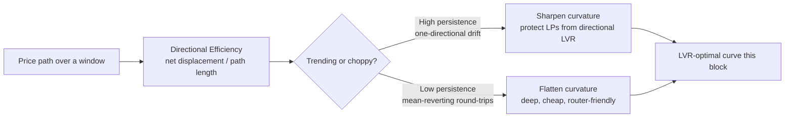
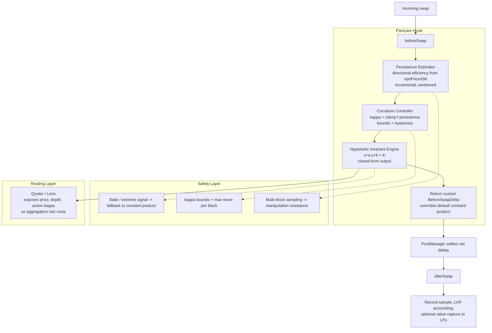
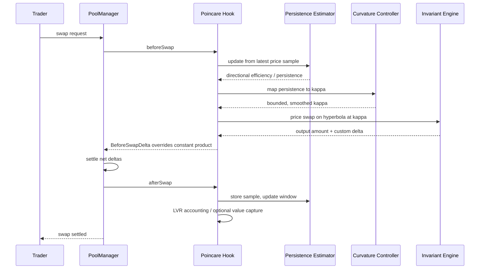

# POINCARÉ

**An adaptive-curvature AMM hook for Uniswap v4 that minimizes directional Loss-Versus-Rebalancing by reshaping its own bonding curve in response to how *trending* the price is — not how volatile.**

---

## TL;DR

A constant-product pool is a **fixed rectangular hyperbola** (`x · y = k`). Its curvature never changes, so it is locked into one trade-off forever: flat enough for low slippage *or* sharp enough to resist arbitrage — never both, never the right one for the moment.

Poincaré makes the hyperbola's **curvature a live function of the price path's directional persistence** — how much the price is *trending* versus *chopping*. The key refinement over every prior "volatility" hook: **LVR is caused by directional moves, not symmetric noise.** A choppy, mean-reverting market is benign for LPs (they earn fees on round-trips); a *trending* market is where they bleed. So the curve sharpens when the price trends and flattens when it chops — placing the pool on the LVR-optimal point of the slippage/loss frontier each block, with **no oracle, no auction, no keeper, no external network.**

For calm or pegged pairs it collapses to a tight, stableswap-like curve automatically. For volatile, trending pairs it becomes a self-defending market maker. One invariant, two regimes, chosen by the market itself.

---

## 1. The problem

An LP earns fees but loses value to better-informed flow every time the price moves. The formal name is **Loss-Versus-Rebalancing (LVR)** — the largest, most permanent cost in automated market making. The Milionis–Moallemi–Roughgarden–Zhang result gives it in closed form:

> **LVR rate ≈ ½ · σ² · (marginal liquidity at the current price).**

Two facts fall straight out:

1. **Curvature is the LVR lever, not the fee.** Marginal liquidity is a property of the *curve's shape*. A flat curve bleeds more LVR; a sharp curve bleeds less. The fee only taxes the trade — it does not change how far the price moves, so it does not govern LVR.
2. **The optimal curvature is conditional on price dynamics.** Because the loss scales with the *square of directional movement*, the curvature that best balances "earn fees from benign flow" against "don't get run over" depends on how the price is actually moving right now.

And the refinement that defines this project: σ² in that identity is realized over a path. A pair can be highly volatile yet mean-reverting — lots of motion, little net displacement, little LVR. The damage comes from **persistent, one-directional drift**. So the correct control signal is not volatility magnitude but **directional persistence**.

What exists today does none of this:

- **Constant-product** picks one curvature forever. Wrong almost always.
- **Concentrated-liquidity ranges** are a static, manual guess; the LP carries all rebalancing.
- **Dynamic-fee hooks** move the *fee* on volatility — the wrong lever, on the wrong signal.

Nobody moves the lever the identity points at — **curvature — driven by the signal that actually causes the loss — directional persistence.** That is the gap Poincaré fills.

---

## 2. The core idea

### 2.1 Generalize the hyperbola

We use a **one-parameter family of hyperbolae** whose curvature is set by a coefficient `κ`, expressed through virtual offsets:

```
(x + a) · (y + b) = K        where a, b grow as κ shrinks
```

- **Low κ (large offsets):** nearly a straight line near the center — flat, deep, minimal slippage, stableswap-like. The benign regime.
- **High κ (offsets → 0):** approaches and exceeds pure `x·y=k` — sharp, high marginal impact, strong adverse-selection resistance. The protective regime.

The family is continuous and all trade math stays closed-form and gas-bounded — no transcendental solves.

### 2.2 Drive curvature with directional persistence

The signal is a **directional-efficiency** measure of the recent price path:

```
persistence  =  | net price displacement |  /  total path length     over a window
```

- Near **1** → the price marched one way → *trending* → LVR danger.
- Near **0** → lots of motion, little net move → *choppy / mean-reverting* → benign.

This is a cheap, incremental proxy for the Hurst exponent (trend vs. mean-reversion), computable per-swap on-chain. The controller maps it to the LVR-optimal curvature:

```
κ*(persistence) = clamp( f(persistence) , κ_min , κ_max )
```

`f` is monotone increasing: more persistence → more curvature → less directional LVR. `clamp` prevents degenerating into a constant-sum line (infinite LVR risk) or a dead, over-sharp curve.

### 2.3 The stable-graceful property (free, not bolted on)

A calm or pegged pair sits near `persistence ≈ 0` → `κ → κ_min` → the flattest, deepest curve → it behaves like a tight stableswap with low slippage. **It does not get worse for stable pairs; it converges to the right curve for them.** And if a "stable" pair depegs, the move becomes persistent, `κ` rises, and the curve sharpens to protect through the event, then re-flattens when calm returns.

---

## 3. Architecture

### 3.1 Concept map — how the signal becomes a curve



### 3.2 System architecture — components and data flow



### 3.3 Components

- **Invariant Engine** — the custom curve. Implemented with `beforeSwapReturnDelta`, so the hook takes over swap accounting and prices on `(x+a)(y+b)=K` at the current curvature instead of the PoolManager's default `x·y=k`. Liquidity is accounted via singleton / ERC-6909 claims; positions are effectively full-range because the curve itself does the concentration.
- **Persistence Estimator (oracle-free)** — the heart and the hardest part. Maintains a windowed **directional-efficiency** statistic from the pool's own `sqrtPriceX96` series. Needs: a noise floor (so calm pairs rest at `κ_min`), smoothing/hysteresis (no per-block flapping), and **multi-block sampling so no single block can fake a trend** (the primary attack surface).
- **Curvature Controller** — maps `persistence → κ*` via the Milionis-grounded law; applies bounds, a max per-block move, and hysteresis. This is where "principled, not heuristic" lives: we compute the LVR-optimal curvature; we don't guess it.
- **Safety Layer** — fallback to `x·y=k` on stale/absurd signal; hard `κ` bounds; circuit breaker that pins a conservative sharp curve on extreme moves.
- **Routing / Lens** — a Quoter/Lens contract exposing effective price, depth, and active `κ` so aggregators (1inch, Matcha, CoW, UniswapX fillers) can integrate and route a custom-curve pool.

### 3.4 Lifecycle — sequence of a single swap



---

## 4. Mathematical foundation

| Object | Role |
|---|---|
| **Milionis LVR identity** (`LVR ≈ ½σ²·marginal liquidity`) | Establishes curvature as the LVR lever and that the optimum is dynamics-dependent. Why this is principled, not heuristic. |
| **Directional-efficiency / persistence statistic** | The control signal — a cheap on-chain proxy for the Hurst exponent (trend vs. mean-reversion). The signal that actually causes LVR. |
| **One-parameter hyperbolic family** `(x+a)(y+b)=K` | The adjustable curve; generalizes `x·y=k`; offsets keep it closed-form. |
| **Curvature law** `κ*(persistence)=clamp(f(·),κ_min,κ_max)` | The control policy placing the pool on the LVR/slippage frontier each block. |

The functional form of `f`, the offset↔κ parameterization, the window length, and the bounds are calibrated during the build — derived from the LVR identity and back-tested on historical paths for the target pair. The README fixes the structure; the constants are tuned empirically.

---

## 5. Scope and honest restrictions

- **Two-asset pairs.** A pair primitive — not a multi-asset basket tool, no N≥3 isolation.
- **Best on volatile, trending-prone pairs** (ETH/USDC, ETH/BTC, volatile alts) where directional LVR dominates — squarely the UHI10 theme.
- **Calm/pegged pairs handled gracefully** (flat regime), competitive for 2-asset stable pairs, but a dedicated multi-asset stableswap still wins on large pegged baskets.
- **Liquidity/flow sensitive.** Deployable on long-tail, safest where depth and a clean price series exist for the estimator.

---

## 6. Comparison against the existing hook landscape — and why it is not a copy

Three axes separate Poincaré from everything below: **(L)** lever = the *curvature of the invariant*, not a fee/spread/auction; **(S)** signal = *directional persistence*, not volatility magnitude or flow direction; **(O)** objective = *prevent directional LVR at the source*, not recapture/insure/target-IV after the fact. No existing hook shares all three; most share none.

### 7.1 vs. the two closest priors — **IV-Targeting AMM (IVTAMM, UHI4)** and **LP Hub (UHI5 / UHI8)**
Both are dynamic-**fee** hooks. IVTAMM moves the fee to hold *implied volatility* constant; LP Hub moves the fee off TradFi toxicity metrics (VPIN, Illiq, inventory) and adds a self-arb module. Poincaré differs on all three axes: it moves **curvature** (not the fee), off **directional persistence** (not volatility/toxicity), to **minimize LVR** (not target constant IV or price toxicity). Different lever, different signal, different objective.

### 7.2 vs. volatility-based dynamic-fee hooks
*(Atrium Dynamic Fee, Volatility Oracle Hook, Dynamic AMM Fees, AutomataHook)* — these change the **fee** on **volatility**. Poincaré changes **curvature** on **persistence**. The fee does not govern LVR; volatility magnitude is not the LVR-causing signal.

### 7.3 vs. directional-fee / imbalance hooks
*(Nezlobin directional-fee implementations, DepegShield / Stable Protection, Aegis Prime's divergence tax, EvenFlow)* — these reprice via **fees** on **instantaneous flow direction / imbalance**. Poincaré reshapes the **curve** based on the **path's persistence over a window** — a different signal (sustained drift vs. single-trade direction) and a different mechanism.

### 7.4 vs. LVR-recapture mechanisms
*(am-AMM, EigenLVR, EigenAuction, Aegis Prime, Argos)* — these let LVR happen and **recapture** it via auctions, AVS, taxes, or Reactive monitoring. Poincaré **prevents** it by curve-shaping, with no auctioneer, AVS, keeper, or external network.

### 7.5 vs. static geometric / multi-asset stableswap curves
*(recent spherical / N-dimensional / "orbital-tick" stableswap geometries, CSMM concentric-orbit designs)* — **static, positive-curvature** geometries for **pegged multi-asset baskets**, solving IL-on-depeg by isolation. Poincaré is the opposite corner: a **dynamic, hyperbolic (negative-curvature)** curve for **volatile two-asset pairs**, solving LVR. Different curvature sign, static vs. moving, basket vs. pair, IL-on-depeg vs. LVR. A counterpart, not a variant.

### 7.6 vs. proprietary-AMM ports — *HyFi (UHI9)*
HyFi brings closed proprietary-MM pricing to EVM. Poincaré is a **transparent, permissionless, LP-owned invariant** fully specified by a published LVR identity, not a private quoting strategy.

### 7.7 vs. oracle-deviation fees — *Devia (UHI9)*
Devia raises **fees** under **oracle uncertainty/staleness** — oracle-dependent. Poincaré is **oracle-free** (signal from the pool's own price) and **curvature-based**.

### 7.8 vs. IL/LVR hedging, insurance, tranching — *schizō, BackStop, Indemnifi, CrossHedge, Lambda, ybAMM, Mochi Yield (UHI9)*
This family **manages the loss after it exists** — tranching, insuring, hedging on a perp/peer, or splitting principal/yield. Poincaré **shrinks the loss before it happens** at the curve level. Fully complementary — a Poincaré pool would hand these products a smaller loss to manage.

### 7.9 vs. order-book-style "professional MM logic" hooks
*(the spread-widening / MM-style risk-pricing entries, incl. LP Hub's framing)* — these overlay an order-book **spread/quote** on top of `x·y=k`. Poincaré changes the **invariant itself**, grounded in a specific LVR identity, not a spread heuristic.

### 7.10 vs. automated liquidity managers / JIT
*(Bunni/Arrakis/Gamma-style range management, JIT-liquidity hooks)* — these **recenter or resize discrete ranges** heuristically, or inject liquidity just-in-time. Poincaré changes the **continuous curvature** of the invariant via a principled persistence→curvature law.

### 7.11 vs. MEV / sandwich-protection hooks
*(EigenShield Flow Sentinel, sealed-bid FHE auction hooks, non-toxic-executor gasless hooks)* — these act at the **mempool/sequencing** layer. Poincaré acts at the **curve** layer and addresses LVR-type leakage structurally; it is not a sandwich detector and could sit alongside one.

### 7.12 vs. prediction-market / scoring-rule AMMs
*(LMSR sports-betting and binary-outcome hooks)* — a different market entirely (bounded-outcome information markets). No overlap.

### Summary

| Axis | Everyone else | **Poincaré** |
|---|---|---|
| Lever | fee, spread, auction, or static curve | **curvature of the invariant** |
| Signal | volatility magnitude, flow direction, oracle | **directional persistence (trend vs. chop)** |
| LVR strategy | recapture / hedge / insure / target-IV | **prevent at the source** |
| External deps | oracle, AVS, keeper, Reactive Network | **none — self-contained** |
| Stable pairs | separate stableswap needed | **flat regime, automatic** |
| Grounding | heuristic | **published LVR identity** |

No prior hook occupies this cell. The differentiation is structural, not cosmetic.

---

## 7. Build roadmap

1. **Lock the reference pair** (volatile, deep — the estimator is designed around it).
2. Implement the **hyperbolic invariant engine** + `beforeSwapReturnDelta` accounting.
3. Implement and **stress-test the persistence estimator** (the make-or-break module).
4. Implement the **curvature controller** + safety layer.
5. **Back-test** `f(persistence)` on historical paths; quantify LVR reduction vs. constant-product *and* vs. a vol-fee baseline; include a manipulation-cost analysis.
6. Ship the **Quoter/Lens**; pursue one router integration.
7. Foundry suite: fuzz/invariant tests, manipulation simulations, gas profiling.
