# POINCARÉ

[](https://github.com/Prakhar-30/POINCARE/actions/workflows/test.yml)

### An adaptive Uniswap v4 AMM that detects real price trends with a provably-optimal change-detector and leans its pricing against them, protecting liquidity providers from the losses that trends cause, without an oracle.

**Recognition and review.** Poincaré was submitted to the **Uniswap Hook Incubator 10 (UHI10)**
hookathon, where it was selected as one of the winners. It was subsequently selected by the
**Uniswap Foundation Security Fund**, which sponsored a security review by **Olympix**; all nine
reported findings are fixed and each carries a regression test that fails on the pre-fix code
(see [§11](#11-security-review)).

Entered at **ETHOnline** under the Continuity track. What pre-existed, what was built during the
hackathon, and how AI tools were used are documented in [`SUBMISSION.md`](./SUBMISSION.md).

The repository was scaffolded from Uniswap's official
[`v4-template`](https://github.com/Uniswap/v4-template), and the detector, control law, curve,
hook and Lens are original work. It depends on no oracle, keeper, AVS, relayer or cross-chain
service, which is a design constraint rather than an omission (see [§12](#12-external-dependencies)).

---

## Where the Uniswap v4 integration lives

A map for reviewers. Poincaré is a **custom-curve v4 hook**, so it replaces native `x·y=k` pricing
rather than sitting alongside it. Line numbers are against the current `main`.

| What | Where | Notes |
|---|---|---|
| **The hook** | [`src/PoincareHook.sol:96`](./src/PoincareHook.sol#L96) | `contract PoincareHook is BaseCustomCurve, ERC20` |
| **Custom-curve pricing** | [`src/PoincareHook.sol:259`](./src/PoincareHook.sol#L259) | `_getUnspecifiedAmount`: prices the swap on our own invariant. This is what `beforeSwapReturnDelta` consumes |
| **`beforeSwap` override** | [`src/PoincareHook.sol:245`](./src/PoincareHook.sol#L245) | Reentrancy guard over the inherited path |
| **Vol fee reported to `HookSwap`** | [`src/PoincareHook.sol:290`](./src/PoincareHook.sol#L290) | `_getSwapFeeAmount` |
| **Hook-owned liquidity** | [`src/PoincareHook.sol:223`](./src/PoincareHook.sol#L223), [`:445`](./src/PoincareHook.sol#L445), [`:497`](./src/PoincareHook.sol#L497) | `addLiquidity`, `_getAmountIn`, `_getAmountOut`; the native tick-liquidity path is reverted |
| **Reserves as ERC-6909 claims** | [`src/PoincareHook.sol:536`](./src/PoincareHook.sol#L536) | `poolManager.balanceOf(address(this), currency.toId())`, never a tracked variable |
| **The quoter** | [`src/PoincareLens.sol:33`](./src/PoincareLens.sol#L33) | `quoteExactInput`. A `view` quote; the canonical `V4Quoter` agrees to the wei but is state-mutating |
| **`HookMiner` CREATE2 deploy** | [`script/DeployPoincareUnichain.s.sol:209`](./script/DeployPoincareUnichain.s.sol#L209) | Mines the salt so permission flags are encoded in the address |
| **Detector libraries** | [`src/libraries/`](./src/libraries/) | `Cusum`, `DirectionalSignal`, `ControlLaw`, `AsymmetricCurve`, `PriceLib`. All original |

**Live deployment** (Unichain Sepolia, chain 1301), against the canonical v4 `PoolManager`
`0x00B036B58a818B1BC34d502D3fE730Db729e62AC`:

| | |
|---|---|
| Hook | `0xa5ABa524A96695Dc4E36BacfF3048aD2F24AAa88` |
| Lens (quoter) | `0x5d360309c7564270c5604067d7fa85e7d2508e02` |
| App | https://poincare-beta.vercel.app |

**Integrating?** The canonical `V4Quoter` prices this pool correctly — it simulates the swap, so
the custom curve applies. [`PoincareLens`](./src/PoincareLens.sol) returns the same numbers as a
plain `view`, which `V4Quoter` is not. [`INTEGRATING.md`](./INTEGRATING.md) is the short version
for routers and aggregators.

Developer feedback on the v4 stack, as required by the Uniswap Stack Contribution prize:
[`FEEDBACK.md`](./FEEDBACK.md).

---

## TL;DR

A normal AMM is a frozen curve: it quotes the same way whether the market is drifting hard in one direction (when liquidity providers bleed value to arbitrageurs) or just chopping around harmlessly. Poincaré watches its own price, runs a **CUSUM quickest-change detector** to decide, with mathematically optimal speed, whether a *genuine* directional trend has begun, and when one has, it **charges a directional spread**: the side the trend is pushing pays a premium the LP keeps (that is the side where LPs lose money), while the stabilising side trades at the plain constant-product price, unpenalised.

The detector fires at a **data-dependent moment**, not after a fixed number of blocks, so there is no countdown for an attacker to game. And because the only way to fool the detector is to *genuinely move the market* (spending real money and feeding arbitrageurs), manipulation is bounded by design, not wished away.

**What it uses:** the *Milionis LVR identity* (why the pool's quote is the lever), a *non-negative directional spread on a symmetric constant-product base* (the actuator; see §3.1), a *directional-efficiency signal*, and *CUSUM / Quickest Change Detection* with *Lorden minimax optimality* (the engine), with *robust-QCD* hardening on the roadmap.

---

## 1. The problem

Liquidity providers lose value to better-informed flow whenever the price moves, a cost with a precise name, **Loss-Versus-Rebalancing (LVR)**. The Milionis–Moallemi–Roughgarden–Zhang identity pins it down:

$$\text{LVR rate} \;\approx\; \tfrac{1}{2}\,\sigma^2 \cdot \big(\text{marginal liquidity}\big)$$

Two truths fall out of that one line:

- **A static fee cannot fix it.** The fee does not appear in that identity at all, so fee-tweaking, which most hooks do, is pulling a lever the equation does not have. Marginal liquidity does appear — but reshaping the curve to reduce it taxes *every* trade, including the flow you want, which is why we built that version, measured it, and rejected it (§3.1). What is left is to make the informed side pay **when, and only when, it is actually informed**.
- **The damage is directional.** LVR is driven by *sustained, one-directional* price moves, not by symmetric noise. A market that thrashes around but goes nowhere barely hurts LPs; a market that *trends* is what drains them.

So the right response is: **quote asymmetrically, charging the side that is taking value and not the side that is giving it back, but only when a real trend is actually happening.** That last clause is the hard part, and the whole project.

---

## 2. The design in one picture

Poincaré has two parts: a **detector** (the brain) that decides *when* there is a real trend, and an **actuator** (the curve) that *acts* on that decision.

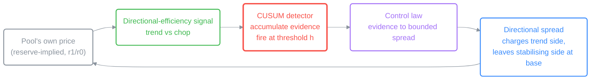
```mermaid
%%{init: {'theme':'base','themeVariables':{'fontFamily':'ui-monospace, monospace','primaryColor':'transparent','primaryTextColor':'#388bfd','primaryBorderColor':'#8b949e','lineColor':'#8b949e','tertiaryColor':'transparent','clusterBkg':'transparent','clusterBorder':'#8b949e'}}}%%
flowchart LR
    PRICE("Pool's own price<br/>(reserve-implied, r1/r0)") --> SIG("Directional-efficiency signal<br/>trend vs chop")
    SIG --> CUSUM("CUSUM detector<br/>accumulate evidence<br/>fire at threshold h")
    CUSUM --> LAW("Control law<br/>evidence to bounded spread")
    LAW --> CURVE("Directional spread<br/>charges trend side,<br/>leaves stabilising side at base")
    CURVE --> PRICE
    classDef io stroke:#8b949e,color:#8b949e,stroke-width:2px;
    classDef sig stroke:#3fb950,color:#3fb950,stroke-width:2px;
    classDef engine stroke:#f85149,color:#f85149,stroke-width:3px;
    classDef law stroke:#a371f7,color:#a371f7,stroke-width:2px;
    classDef curve stroke:#388bfd,color:#388bfd,stroke-width:2px;
    class PRICE io;
    class SIG sig;
    class CUSUM engine;
    class LAW law;
    class CURVE curve;
```

The novelty is the **detector**: no AMM in the Uniswap hook ecosystem uses change-point detection. The directional spread is just where its decision lands.

---

## 3. The mathematics we use

### 3.1 The actuator: a directional spread on a symmetric curve

**The pool's curve is `x·y = k`, and it stays `x·y = k`.** In calm markets, in a trend, buying, selling: one curve, one shape, always. Nothing about the geometry moves.

What moves is the **price one side is quoted**. When the detector says a trend is running, a swap pushing *with* that trend is charged a spread `κ` on top of the curve price, which the LP keeps. A swap pushing *against* it — the one helping the price back toward fair — is quoted the plain curve price and pays nothing extra. That is the whole actuator:

$$
\text{quote} = \underbrace{\text{curve price}}_{x\cdot y\,=\,k,\ \text{never changes}} \;\times\; \big(1 - \kappa \cdot \mathbb{1}[\text{with the trend}]\big)
$$

It is a **one-sided bid–ask spread**, the same instrument a human market maker widens when they think they are being picked off, and it is set by evidence rather than by feel. Because `κ ≥ 0` only ever *worsens* the trader's execution, and because it sits on a base price that both directions share, **every round trip is strictly unprofitable by construction** — proven by fuzzing and a 384k-operation invariant.

> **A note on what this is *not*, because the obvious design is the wrong one.**
> The intuitive way to make an AMM lean is to reshape it — give each direction its own curvature, steep against the flow you dislike and flat for the flow you want, via direction-dependent virtual offsets `(x + a±)(y + b±) = K`. We started there, and it does not work. Choosing different depths per direction moves the **mid-price**, not just the spread, which opens a free round trip: buy on the shallow branch, sell back on the deep one, walk away with pool value. We reproduced that drain concretely; it is a hole an MEV bot empties on day one.
>
> The deeper problem is that it also *loses*. We later built a round-trip-safe, split-invariant version of the depth lever and measured it against the spread across four years of real ETH/USDC. It lost by roughly **thirty to one**. Steepening taxes every trade, and real months are mostly reversal, so a reshaped curve leans against flow that is about to turn.
>
> So curvature is **closed, not deferred**: no depth-asymmetry mode exists in the codebase, no configuration enables one, and `test/DeployedConfig.t.sol` pins `alphaWad == 0` so it cannot be switched on by accident. The spread is not a compromise we settled for. It is the mechanism, and the only one. Evidence in [`analysis/OPEN_ITEMS.md`](./analysis/OPEN_ITEMS.md) E1.

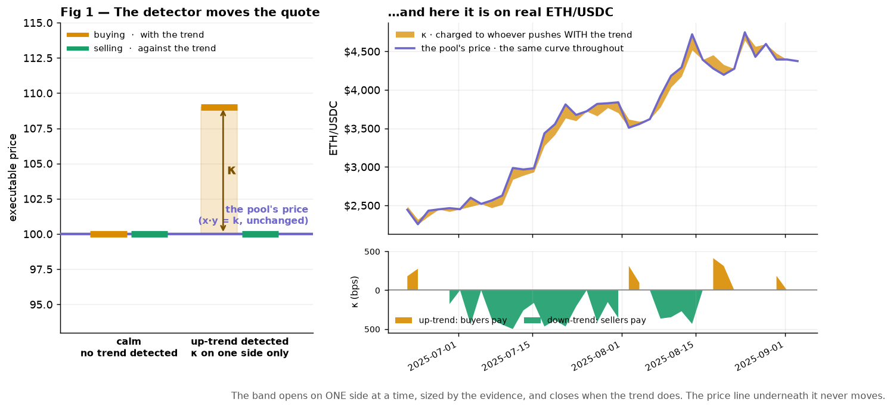

*Fig 1. Left: the pool's price is one line, the same in every regime. Under a detected up-trend the side buying into it is quoted κ worse; the side selling back is quoted the pool price, unpenalised. Right: the same κ over three months of real ETH/USDC, with the lower panel showing which side is being charged. The band opens on one side at a time and closes when the trend does — and the price line underneath it never moves. κ is exaggerated on the left for legibility; the deployed cap is 0.05.*

### 3.2 The signal: directional efficiency

We measure how *trending* the recent path is with a directional-efficiency ratio (a cheap, on-chain proxy for the Hurst exponent):

$$D \;=\; \frac{\big|\,P_{\text{now}} - P_{\text{window start}}\,\big|}{\sum_i \big|\,P_i - P_{i-1}\,\big|} \;\in\; [0,1]$$

Near **1** the price marched one way (trend); near **0** it moved a lot but went nowhere (chop). This feeds the detector.

### 3.3 The engine: CUSUM / Quickest Change Detection

This is the heart. The question "has a *real* regime change (a trend) started, and how fast can I be sure without crying wolf on noise?" is the mathematics of **Quickest Change Detection**, and its optimal workhorse is the **CUSUM** statistic (Page, 1954). It recursively accumulates the evidence and fires when it crosses a threshold:

$$S_t \;=\; \max\!\big(0,\; S_{t-1} + (\ell_t - k)\big), \qquad \text{alarm when } S_t \ge h$$

where `ℓ_t` is the per-step increment, `k` is a slack constant, and `h` is the only real knob, set by the tolerable **false-alarm rate**, *not* by a hard-coded number of blocks. The MVP uses the **Gaussian-form increment** `ℓ_t = r_t` (the signed log-return), the standard CUSUM workhorse; the heavy-tailed **log-likelihood-ratio** variant is the §3.4 roadmap item.

Why this is the right tool, and not a heuristic:

- **The firing moment is a *stopping time*: data-dependent and unpredictable.** A strong, real trend crosses `h` fast; weak noise never does. There is no fixed "after N blocks" for an attacker to exploit.
- **It is provably optimal.** CUSUM is asymptotically optimal under **Lorden's minimax criterion**: it minimises the worst-case delay to detect a true change for any given false-alarm rate. That is the best-possible resolution of the "react fast vs don't get fooled" tension.

### 3.4 The hardening: robust / minimax QCD *(clip shipped; full minimax analysis on the roadmap)*

The attacker who tries to fool the detector is itself a studied problem. **Minimax-robust QCD** designs the test against worst-case (least-favourable) distributions, and the **covert-adversary-vs-CUSUM** results let us *quantify* how costly it is to delay or trigger the detector.

**What the MVP actually relies on for manipulation resistance** is not the robust increment (that is the heavy-tailed roadmap upgrade) but three concrete, *implemented* layers, proven in the test-suite (§4.2, §4.4): (1) the **data-dependent firing time** removes any countdown to game; (2) the **bounded, one-sided spread** means the soft side trades at the base price, so faking a trend yields **zero** extractable advantage on the other side (`max_soft_gain ≡ 0`); and (3) **arbitrage** makes genuinely moving the price costly (`min_trigger_cost > 0`). The robust-QCD increment hardens layer (1) further against heavy-tailed crypto returns and is the next detector upgrade; see **§9.2** for the self-normalizing, self-calibrating **v2** that builds on it (thresholds expressed in units of the live volatility σ, so they adapt to the market automatically).

### 3.5 The control law: evidence to a bounded spread

The detector's accumulated evidence sets the size of the directional spread, **bounded** so it can never grow far enough to be worth gaming:

$$\kappa \;=\; \text{clamp}\big(f(S_t),\; \kappa_{\min},\; \kappa_{\max}\big)$$

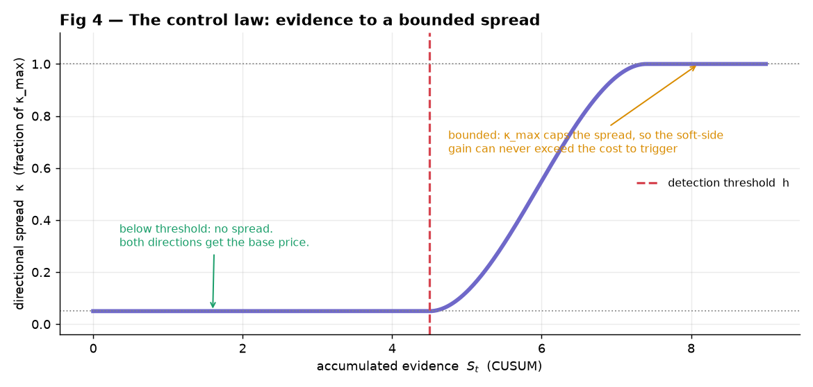

*Fig 4. Evidence to a bounded spread. Below the threshold the pool quotes the base price in both directions. Past it, κ ramps smoothly and saturates at κ_max, which is a security parameter rather than a tuning one: it caps the most the soft side can ever be worth, so faking a trend cannot pay for itself.*

---

## 4. How it works: the full lifecycle

### 4.1 Architecture

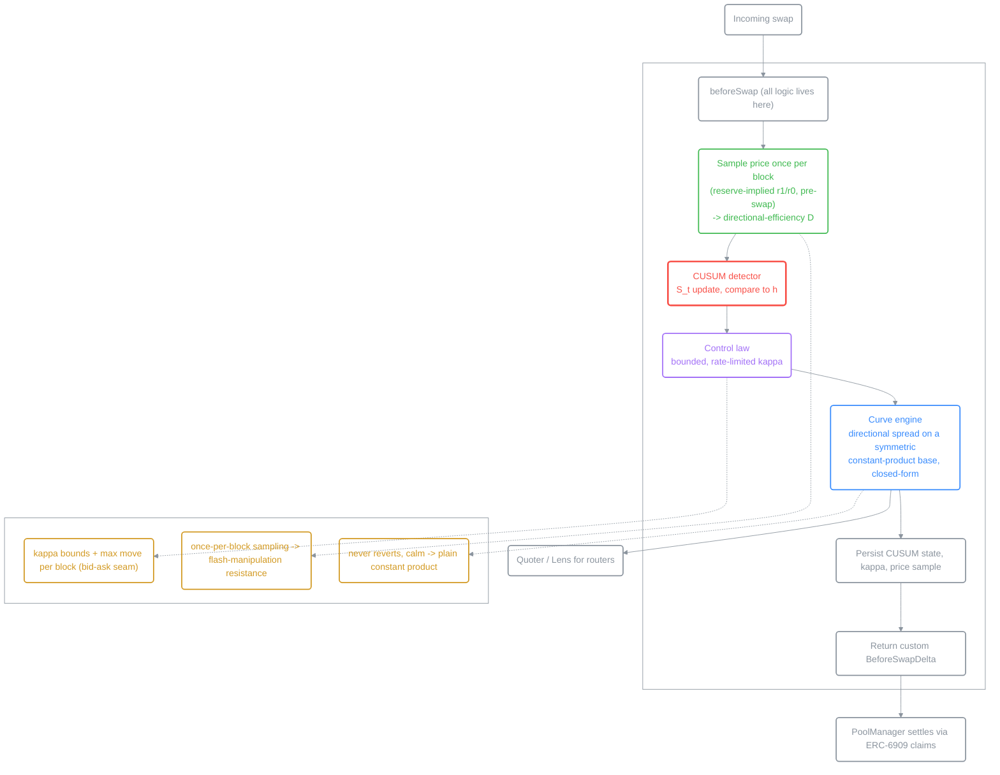
```mermaid
%%{init: {'theme':'base','themeVariables':{'fontFamily':'ui-monospace, monospace','primaryColor':'transparent','primaryTextColor':'#388bfd','primaryBorderColor':'#8b949e','lineColor':'#8b949e','tertiaryColor':'transparent','clusterBkg':'transparent','clusterBorder':'#8b949e'}}}%%
flowchart TD
    SWAP("Incoming swap") --> BS("beforeSwap (all logic lives here)")
    subgraph HOOK["Poincare Hook"]
        BS --> EST("Sample price once per block<br/>(reserve-implied r1/r0, pre-swap)<br/>-> directional-efficiency D")
        EST --> DET("CUSUM detector<br/>S_t update, compare to h")
        DET --> LAW("Control law<br/>bounded, rate-limited kappa")
        LAW --> INV("Curve engine<br/>directional spread on a symmetric<br/>constant-product base, closed-form")
        INV --> PERSIST("Persist CUSUM state, kappa, price sample")
        PERSIST --> DELTA("Return custom BeforeSwapDelta")
    end
    DELTA --> SETTLE("PoolManager settles via ERC-6909 claims")
    subgraph SAFETY["Safety layer"]
        BND("kappa bounds + max move per block (bid-ask seam)")
        ROB("once-per-block sampling -> flash-manipulation resistance")
        CB("never reverts, calm -> plain constant product")
    end
    EST -.-> ROB
    LAW -.-> BND
    INV -.-> CB
    INV --> LENS("Quoter / Lens for routers")
    classDef io stroke:#8b949e,color:#8b949e,stroke-width:2px;
    classDef sig stroke:#3fb950,color:#3fb950,stroke-width:2px;
    classDef engine stroke:#f85149,color:#f85149,stroke-width:3px;
    classDef law stroke:#a371f7,color:#a371f7,stroke-width:2px;
    classDef curve stroke:#388bfd,color:#388bfd,stroke-width:2px;
    classDef safety stroke:#d29922,color:#d29922,stroke-width:2px;
    class SWAP,BS,PERSIST,DELTA,SETTLE,LENS io;
    class EST sig;
    class DET engine;
    class LAW law;
    class INV curve;
    class BND,ROB,CB safety;
```

### 4.2 A swap, step by step

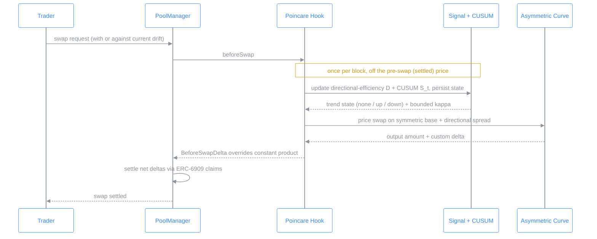
```mermaid
%%{init: {'theme':'base','themeVariables':{'fontFamily':'ui-monospace, monospace','actorBkg':'transparent','actorBorder':'#388bfd','actorTextColor':'#388bfd','actorLineColor':'#8b949e','signalColor':'#8b949e','signalTextColor':'#8b949e','noteBkgColor':'transparent','noteBorderColor':'#d29922','noteTextColor':'#d29922','activationBkgColor':'transparent','activationBorderColor':'#8b949e','sequenceNumberColor':'#0d1117'}}}%%
sequenceDiagram
    participant T as Trader
    participant PM as PoolManager
    participant H as Poincare Hook
    participant E as Signal + CUSUM
    participant I as Asymmetric Curve

    T->>PM: swap request (with or against current drift)
    PM->>H: beforeSwap
    Note over H,E: once per block, off the pre-swap (settled) price
    H->>E: update directional-efficiency D + CUSUM S_t, persist state
    E-->>H: trend state (none / up / down) + bounded kappa
    H->>I: price swap on symmetric base + directional spread
    I-->>H: output amount + custom delta
    H-->>PM: BeforeSwapDelta overrides constant product
    PM->>PM: settle net deltas via ERC-6909 claims
    PM-->>T: swap settled
```

### 4.3 Lifecycle on a *real* trend

A pool is deployed with the hook. Swaps begin. While the market only chops, the directional-efficiency signal stays low, the CUSUM statistic hovers near zero, and **the curve stays symmetric and deep, best-in-class execution for everyone.** Then a genuine trend begins. The CUSUM statistic starts climbing as evidence accumulates; it does *not* fire on the first few trades (that would be crying wolf). Only when the evidence crosses the threshold (a moment that depends on how strong the trend is, not on a fixed clock) does the regime flip and the curve begin to lean against the trend.

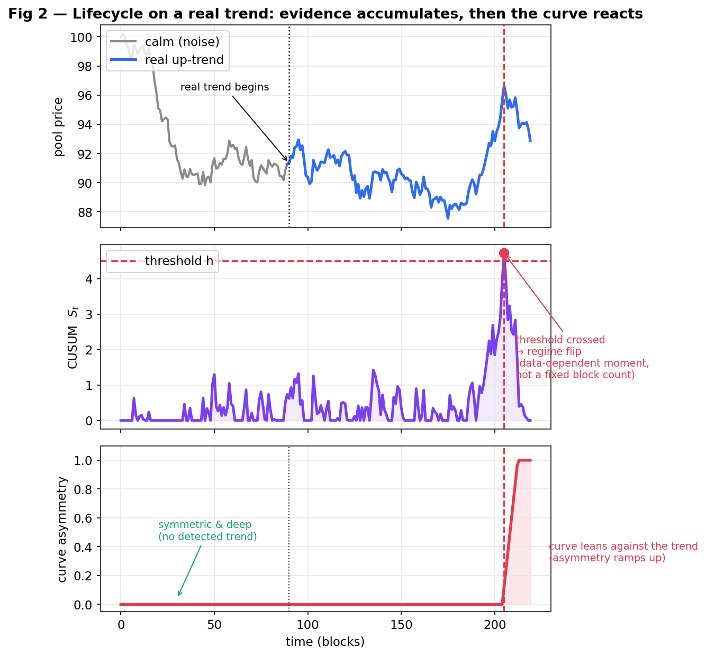

*Fig 2. Top: the pool price, calm then trending. Middle: the CUSUM statistic accumulating evidence and crossing the threshold at a data-dependent moment. Bottom: the curve's asymmetry, flat until detection, then ramping up to lean against the trend. Notice the detector ignores the early noise and only commits when the evidence is real.*

### 4.4 What happens when someone fakes a trend

This is the crux, and the figure makes it concrete. To push the CUSUM statistic to its threshold, an attacker cannot simply *signal* a trend; they must **actually move the price**, with real buys and real money. But moving the price away from fair value opens an arbitrage gap, and arbitrageurs immediately trade against them, capping the move and snapping it back the moment the attacker stops. So the attacker's cost climbs the whole time, and the unwind hands their losses straight to the arbitrageurs.

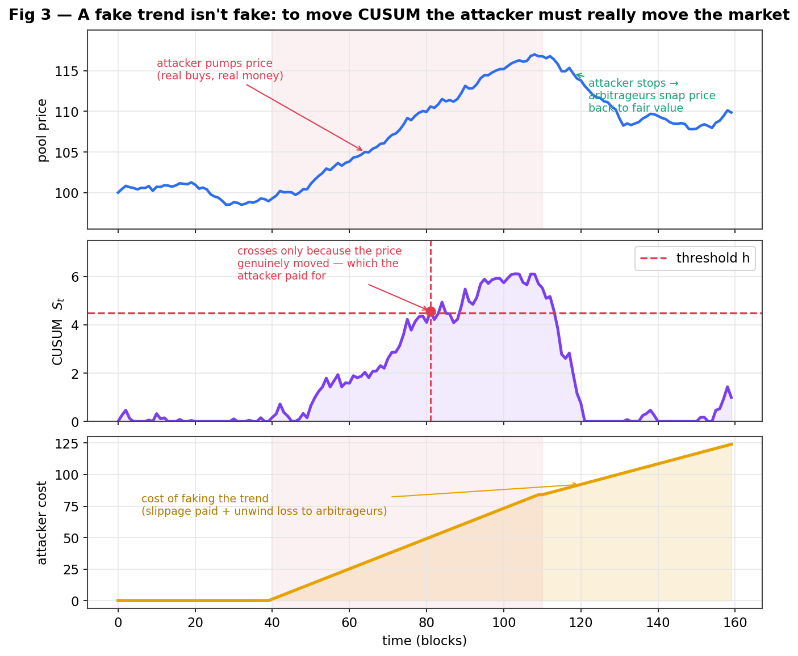

*Fig 3. Top: the attacker genuinely pumps the price (real money), and arbitrageurs snap it back when they stop. Middle: the CUSUM does cross, but only because the price truly moved, which the attacker paid for. Bottom: the attacker's mounting cost. The "fake" trend was never fake; it was a real, expensive market move. Combined with the bounded asymmetry (Fig 4), the soft-side advantage they could capture is held below this cost, so the attack does not pay.*

The defence is therefore three layers working together: the **data-dependent CUSUM** removes the predictable countdown, the **bounded asymmetry** caps the prize, and **natural arbitrage** punishes anyone who tries to manufacture the move.

### 4.5 The full lifecycle, and how it differs from a normal pool

This is the heart of the novelty in one picture: one pool walked through an entire regime cycle (calm, a real trend, detection, the lean, and the return to calm), showing exactly *when* and *why* the curve changes.

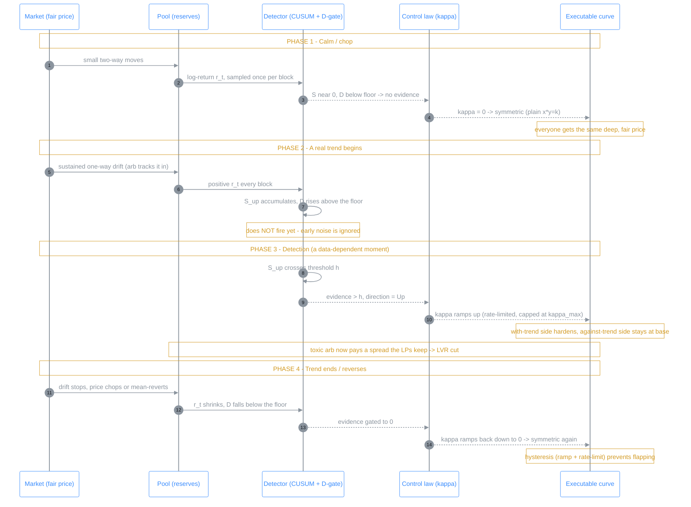
```mermaid
%%{init: {'theme':'base','themeVariables':{'fontFamily':'ui-monospace, monospace','actorBkg':'transparent','actorBorder':'#388bfd','actorTextColor':'#388bfd','actorLineColor':'#8b949e','signalColor':'#8b949e','signalTextColor':'#8b949e','noteBkgColor':'transparent','noteBorderColor':'#d29922','noteTextColor':'#d29922','activationBkgColor':'transparent','activationBorderColor':'#8b949e','sequenceNumberColor':'#0d1117'}}}%%
sequenceDiagram
    autonumber
    participant M as Market (fair price)
    participant P as Pool (reserves)
    participant D as Detector (CUSUM + D-gate)
    participant K as Control law (kappa)
    participant C as Executable curve

    Note over M,C: PHASE 1 - Calm / chop
    M->>P: small two-way moves
    P->>D: log-return r_t, sampled once per block
    D-->>K: S near 0, D below floor -> no evidence
    K-->>C: kappa = 0 -> symmetric (plain x*y=k)
    Note over C: everyone gets the same deep, fair price

    Note over M,C: PHASE 2 - A real trend begins
    M->>P: sustained one-way drift (arb tracks it in)
    P->>D: positive r_t every block
    D->>D: S_up accumulates, D rises above the floor
    Note over D: does NOT fire yet - early noise is ignored

    Note over M,C: PHASE 3 - Detection (a data-dependent moment)
    D->>D: S_up crosses threshold h
    D-->>K: evidence > h, direction = Up
    K-->>C: kappa ramps up (rate-limited, capped at kappa_max)
    Note over C: with-trend side hardens, against-trend side stays at base
    Note over P,C: toxic arb now pays a spread the LPs keep -> LVR cut

    Note over M,C: PHASE 4 - Trend ends / reverses
    M->>P: drift stops, price chops or mean-reverts
    P->>D: r_t shrinks, D falls below the floor
    D-->>K: evidence gated to 0
    K-->>C: kappa ramps back down to 0 -> symmetric again
    Note over C: hysteresis (ramp + rate-limit) prevents flapping
```

**Side by side, on the very same trend**, against a normal constant-product pool:

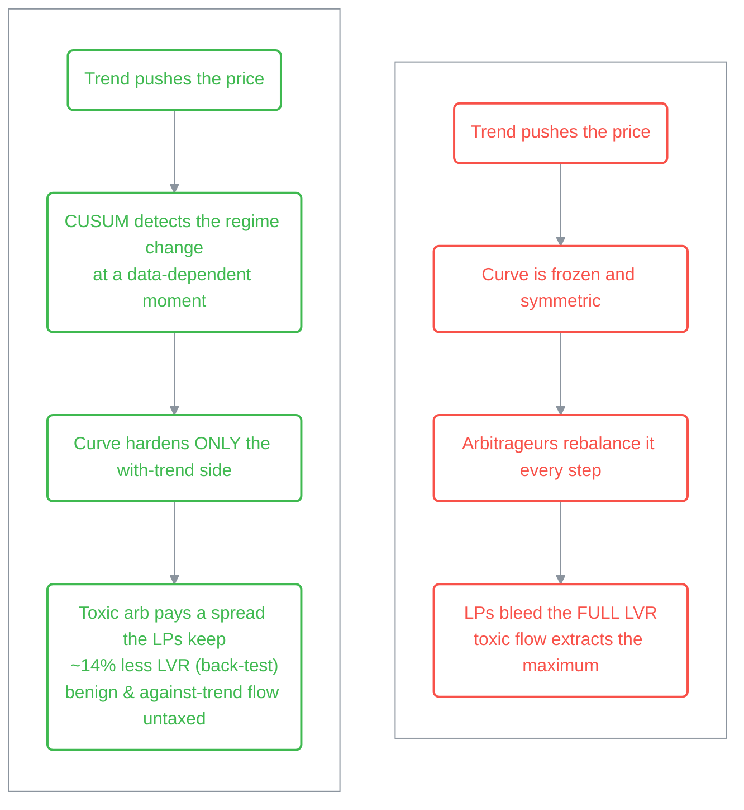
```mermaid
%%{init: {'theme':'base','themeVariables':{'fontFamily':'ui-monospace, monospace','primaryColor':'transparent','primaryTextColor':'#388bfd','primaryBorderColor':'#8b949e','lineColor':'#8b949e','tertiaryColor':'transparent','clusterBkg':'transparent','clusterBorder':'#8b949e'}}}%%
flowchart TB
    subgraph NORMAL["A normal constant-product pool"]
        direction TB
        N1("Trend pushes the price") --> N2("Curve is frozen and symmetric")
        N2 --> N3("Arbitrageurs rebalance it every step")
        N3 --> N4("LPs bleed the FULL LVR<br/>toxic flow extracts the maximum")
    end
    subgraph POIN["The Poincare pool"]
        direction TB
        Q1("Trend pushes the price") --> Q2("CUSUM detects the regime change<br/>at a data-dependent moment")
        Q2 --> Q3("Curve hardens ONLY the with-trend side")
        Q3 --> Q4("Toxic arb pays a spread the LPs keep<br/>~14% less LVR (back-test)<br/>benign & against-trend flow untaxed")
    end
    classDef bad stroke:#f85149,color:#f85149,stroke-width:2px;
    classDef good stroke:#3fb950,color:#3fb950,stroke-width:2px;
    class N1,N2,N3,N4 bad;
    class Q1,Q2,Q3,Q4 good;
```

A normal pool cannot tell a trend from chop, so it offers the same terms to toxic and benign flow alike and pays the full LVR. Poincaré spends a small, bounded spread *only* on the flow that is actually hurting LPs, *only* while a real trend is confirmed, and routes it back to the LPs.

---

## 5. Why it benefits everyone

- **Liquidity providers** keep the value that normally leaks to arbitrageurs during trends, *and*, unlike a symmetric defence, keep their fee volume, because only the toxic side is hardened while the benign side stays open.
- **Traders** stabilising the pool (trading against the drift) trade at the **full base price with no spread**: they are never charged for the trend, while toxic with-trend flow is; ordinary traders in calm markets see the symmetric base curve.
- **Routers / aggregators** prefer it for exactly that reason (better execution on the flow it welcomes), and a first-class Quoter/Lens makes the custom curve easy to integrate.

It does not make liquidity provision risk-free: the LP still holds the assets and feels genuine market moves. It removes the *avoidable* arbitrageur tax (the LVR), not the underlying exposure.

---

## 6. Scope and honest restrictions

- **Two-asset pairs**, and it is built for **volatile, free-floating pairs** (ETH/USDC, ETH/BTC, volatile majors) where directional LVR dominates.
- **Calm and pegged pairs are handled gracefully**: low signal keeps the curve symmetric with the spread at zero (plain constant-product execution for everyone); a sudden depeg is just a detected trend the curve leans into. (A deep, stableswap-like *base* curve is a roadmap option, since the curve engine already supports virtual offsets; the MVP uses a constant-product base.)
- **Liquidity- and flow-sensitive.** Deployable on long-tail pools, safest where there is real depth and a clean price series for the detector.
- The detector raises and *bounds* the cost of manipulation; it does not claim to make it impossible. The manipulation-cost analysis is a first-class deliverable, not a footnote.

---

## 7. Why this is not a copy

The asymmetric-curve idea alone would resemble the directional-fee family (Nezlobin and its descendants). What makes Poincaré a different object is the **engine**: a **Quickest-Change-Detection trend detector** governs *when* it acts. A scan of the entire 562-hook UHI directory and the UHI9 winners returns **zero** uses of CUSUM, change-point detection, SPRT, or quickest detection; the signals in use are simple EWMAs, TWAPs, and imbalance thresholds with fixed cut-offs, precisely what an attacker can game. Poincaré is, to our knowledge, the **first AMM whose regime-switching is governed by a provably-optimal sequential change detector, firing at a data-dependent moment no attacker can precompute.** The curve is the actuator; the detector is the contribution.

| Axis | Existing hooks | **Poincaré** |
|---|---|---|
| Lever | fee / spread / static curve | **a directional, trend-gated spread on one fixed curve: arb-safe by construction, and measured against the depth alternative over four years of real data** |
| Trigger | fixed window / threshold / oracle | **CUSUM stopping time (data-dependent)** |
| Optimality | heuristic | **Lorden minimax-optimal detection** |
| Manipulation | hopes the signal is hard to fake | **bounded prize (soft-gain ≡ 0) + arbitrage punishment; robust-QCD on the roadmap** |
| External deps | oracle / AVS / keeper | **none, self-contained** |

---

## 8. Integration: routing and best-fit pairs

**Will routers find it, and will they pick it?** A Poincaré pool is a normal Uniswap v4 pool from the `PoolManager`'s point of view, discoverable like any other. We assumed for a long time that the vanilla v4 Quoter could not price a custom curve; **that was wrong**, and the fork test that was written to prove it disproved it instead. `V4Quoter` simulates a real swap rather than computing `x·y=k`, so `beforeSwap` runs and it quotes our curve exactly — [`test/sim/ForkRouterLens.t.sol`](./test/sim/ForkRouterLens.t.sol) asserts the agreement to the wei with a spread actively engaged. **`PoincareLens`** returns the same numbers and earns its place on a narrower point: it is a plain `view`, where `V4Quoter` is state-mutating and so cannot be `staticcall`ed from a view context. Integration means "quote via either, prefer the Lens if you need a view."

Given correct quotes, selection is a **feature of the design, not a hope**:

- For **calm-market and against-trend (stabilising) flow**, Poincaré quotes the *full base price with no spread*, competitive with, and often better than, a pool charging a static or vol-scaled fee. Best-execution routers will pick it for exactly this flow.
- For **with-trend (toxic) flow during a confirmed trend**, Poincaré deliberately quotes *worse* (the spread). Routers send that flow elsewhere, which is the point: the pool sheds the flow that costs LPs money and keeps the flow that doesn't.

So the routing dynamics are self-selecting: Poincaré wins the benign/stabilising order flow and declines the toxic flow, which is precisely the LP-favourable split.

**Which pairs does it work best for?**

- **Best:** liquid, free-floating, **volatile majors with real trend episodes amid calm**: ETH/USDC, ETH/BTC, major L1/L2 tokens vs a stable. This is where directional **LVR dominates**, where the detector has a clean, deep price series, and where genuine manipulation is expensive, the exact regime the back-test models.
- **Graceful but low-upside:** tightly **pegged stables** (USDC/USDT). Little directional LVR to recover, so the curve simply stays symmetric and cheap; a depeg is just a detected trend it leans into.
- **Weakest fit:** **thin / long-tail** pools: a noisy price makes detection less reliable and makes the price cheaper to move, which raises the (still-bounded) manipulation surface. Deploy here only with conservative `k, h, κ_max`.

The single most important property for a good fit is a **deep, clean, free-floating price series with occasional real trends**, the conditions under which a quickest-change detector is both useful and safe.

## 9. Proof: a WETH/USDC stress simulation on a Sepolia v4 fork

Beyond the in-memory back-test, the hook was run **end-to-end against the real Uniswap v4
`PoolManager` deployed on Sepolia** (forked locally). Two pools are deployed on that real
PoolManager, seeded identically and fed the **same** fair-price path and the **same** order flow,
differing in one parameter only:

- **POINCARÉ:** the hook with the detector + 5% directional-spread cap live;
- **CONTROL:** the *same hook* with `κ_max = 0`, i.e. a pure constant-product `x·y=k` AMM.

The control is therefore a true apples-to-apples baseline: any difference is attributable solely
to the Poincaré asymmetry. Each block an arbitrageur drags both pools toward fair (the LVR
channel) and an identical uninformed order hits both; every swap is logged. The run spans **8
stress regimes** (calm, trends, a flash crash, whipsaw) over **1,040 blocks / 3,842 real swaps**.

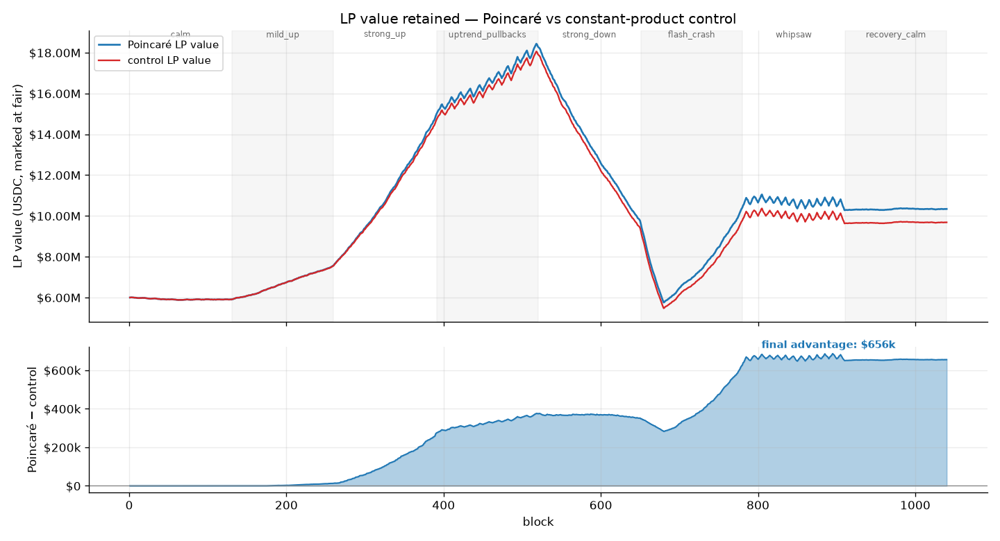

| metric | POINCARÉ | CONTROL | result |
|---|---:|---:|---|
| Cumulative LVR (arbitrageur extraction) | 103,490 USDC | 221,227 USDC | **−53.2%** |
| **LP value retained** (marked at fair) | **10,340,969 USDC** | 9,685,443 USDC | **+$655,526** |

That row is one seed. Re-running the whole schedule on **5 independent seeds** (fresh market,
fresh order book, fresh pools each time) gives **47.1% - 53.2%, mean 50.6%**, with every path
showing a reduction - asserted, not just averaged, in
`test_multiSeed_poincareNeverTrailsControl`. **50.6% is the number to quote**; the 53.2% above
is the top of the range.

> These figures roughly **doubled** when the gate was recalibrated (mean 22.9% → 50.6%). That
> is the same `dFloor` change described in [§9.4](#94-why-the-configuration-changed-and-what-it-was-read-against),
> and the size of the jump is a fair reflection of what a synthetic path rewards: these are
> *designed* trend regimes, so a detector that engages sooner spends much more of the run
> leaning. Real months are mostly reversal, which is why [§9.1](#91-against-real-market-data-12-months-of-ethusdc)
> below moves far less. **Treat the real-data number as the honest one** and this as an upper
> bound on a market built to suit the mechanism.

The LP-value advantage is **flat in calm** (the detector correctly does not engage, nothing to
protect), **grows through the trends**, and **jumps during the flash-crash + whipsaw**, where Poincaré
helps most in exactly the high-LVR regimes (strong_up **−54%**, flash_crash **−83%**) where LPs
bleed the most. Full methodology, per-scenario breakdown, the two order books, and honest caveats:
[`analysis/simulation/SIMULATION.md`](analysis/simulation/SIMULATION.md). Reproduce with
`FOUNDRY_PROFILE=sim forge test --match-path test/sim/ForkSimulation.t.sol` then
`python analysis/simulation/plot.py`.

### 9.1 Against real market data: 12 months of ETH/USDC

The same comparison, but driven by **real Binance ETHUSDC 4h closes** (2025-09-13 → 2026-09-12,
2,190 candles) instead of a synthetic path. Over this window ETH went **$4,759 → $2,523**, with a
high of $4,759 and a low of $1,544, through several distinct regimes.

Two things make this study harsher than the synthetic one:

1. **The detector is calibrated on this pair's own returns.** `k` and `h` are not chosen;
   `test/calibration/RealDataCalibration.t.sol` measures ARL₀ and detection delay on the real,
   heavy-tailed return distribution of the **first half** of the series and derives `k = 0.25σ`
   and `h = 6.00σ` from σ = 0.014443 per bar, giving ARL₀ = 120 bars (about 20 days between false
   alarms) and a detection delay of 21 bars. The second half is therefore genuinely
   **out-of-sample**. Method: [`analysis/CALIBRATION.md`](analysis/CALIBRATION.md).
2. **A third pool: a symmetric vol-scaled fee at a matched friction budget.** Any spread reduces
   LVR, so beating plain `x·y=k` proves nothing on its own. The question is whether spending a
   friction budget **directionally** beats spending it **symmetrically**. `FEE_GAMMA` is sized so
   the baseline costs uninformed traders the same, and the test **asserts** the match within 25%
   so the comparison cannot quietly drift into being unfair.

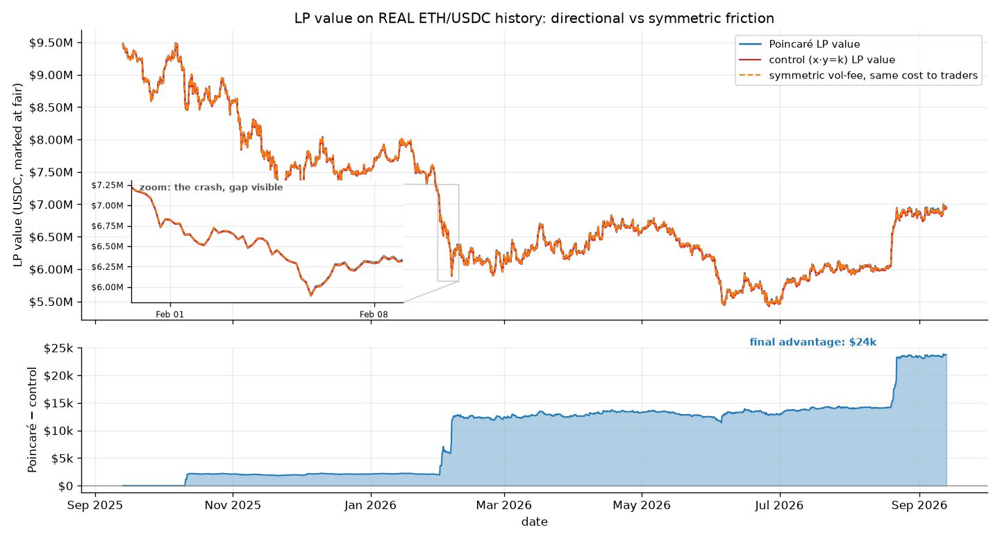

| metric | POINCARÉ | CONTROL | VOLFEE (matched) |
|---|---:|---:|---:|
| Cumulative LVR | 312,792 | 328,143 | 309,545 |
| LVR vs control | −4.67% | — | **−5.66%** |
| Cost to uninformed flow | 4,535 | 0 | 4,529 |
| LP value advantage | **+34,032** | — | +23,401 |
| LP value per unit of trader cost | **7.51** | — | 5.17 |

**The two metrics point different ways, and both are reported.** On raw LVR reduction the
symmetric fee beats Poincaré, 5.66% against 4.67%. On **LP value retained**, which is the ground
truth the harness marks at fair, Poincaré leads by 45%: +34,032 against +23,401, for an identical
friction budget (4,535 against 4,529, matched to 0.13%). A symmetric fee collects on every block
from everyone, and Poincaré collects only from the flow that is taking money out of LPs, which is
why it converts a given friction budget into more retained LP value while reducing *less* measured
LVR. Per unit of trader cost the gap is 7.51 against 5.17.

> **Both columns moved when the gate was recalibrated, and the baseline moved more.** At the old
> gate this read 4.27% against 4.41% with Poincaré 30% ahead on LP value. Lowering `dFloor` to the
> deployed setting raised Poincaré's LP advantage by 44% (+23,706 → +34,032) — but it also raised
> Poincaré's friction, so `FEE_GAMMA` had to rise from 0.0441 to 0.0568 to keep the budgets
> matched, and the better-funded baseline improved its own LVR reduction more (4.41% → 5.66%).
> Reporting the LVR column without re-tuning that constant would have shown Poincaré winning it,
> which is the trap [§9.4](#94-why-the-configuration-changed-and-what-it-was-read-against)
> describes: an unmatched baseline is a handicap, not a baseline.

**By half of the window:**

| half of the window | POINCARÉ vs control | VOLFEE vs control |
|---|---:|---:|
| H1, the calibration sample | −5.39% | **−5.86%** |
| **H2, out-of-sample** | −3.23% | **−5.28%** |

On LVR the baseline holds its edge in both halves, and widens it out-of-sample. The synthetic
stress path in §9 (−50.6% mean over 5 seeds) is trend-dense by construction, which is precisely
why it flatters the design, and this run remains the honest counterweight to it: the same gate
change that doubled the synthetic number moved the real-data LVR column against us.

Two things survive everywhere. **LVR ≤ control throughout** (asserted in the test), so leaning
against detected trends never costs LPs more than doing nothing. And the qualitative property no
LVR aggregate captures: flow trading *against* the drift, and all flow in calm markets, pays
**nothing**, ever, while a symmetric fee taxes it on every block.

One caveat materially favours Poincaré and is still not modelled: the harness forces the same
uninformed order through every pool, so a benign trader pushing with the trend pays the full `κ`.
In reality they would route elsewhere (§8) and never pay it, so Poincaré's measured cost to benign
flow is an overstatement, and the LP-value-per-unit-cost figure above is therefore a floor rather
than a ceiling. A routing-aware flow model is the next refinement and the change most likely to
move this result. Full methodology, per-half breakdown and caveats:
[`analysis/simulation/SIMULATION.md`](analysis/simulation/SIMULATION.md). Reproduce:
`python analysis/simulation/fetch_realdata.py` →
`FOUNDRY_PROFILE=sim forge test --match-path test/sim/ForkRealData.t.sol` →
`python analysis/simulation/plot_realdata.py`.

### 9.2 v2: a self-normalizing, self-calibrating detector *(now implemented as a deploy-time mode)*

> **Status (2026-07): built, tested, backtested.** The hook takes an `adaptive` flag: when set,
> the CUSUM consumes the standardized increment `r_t/σ̂_t` (σ̂ from the on-chain `ewmaTV`), with
> `k, h, sMax` expressed in σ-units and a `sigmaFloor` guard, plus an always-on Huber clip
> (`clipWad`) that bounds any single block's influence. On the same synthetic backtest path the
> adaptive detector cuts LVR **29.6%** vs constant-product — versus 14.3% for the absolute mode —
> **with no absolute-scale calibration at all** (the self-calibration claim, demonstrated). The
> σ-inflation attack is simulated end-to-end (`test/manipulation/`): whipsawing σ̂ up burns value
> every block and the blindness decays with λ. What remains open before `adaptive = true` carries
> real value is the *quantitative* worst-case bound below (OPEN_ITEMS V1); the live testnet demo
> deploys the proven absolute mode.

The original design rationale, kept for context. In the absolute mode the detector parameters
(`k` slack, `h` threshold, …) are **fixed at deploy**: calibrated, but static, so a structural
change in the pair's volatility eventually makes them stale. The **v2 variant** makes the
*detection* thresholds **adapt to the market automatically**, with no governance and no
parameter writes:

- Express the slack and threshold in **units of the running volatility σ** rather than in absolute
  log-return units (e.g. `k ≈ 0.5σ`, `h ≈ 5σ`) and feed the CUSUM the **standardized increment**
  `r_t / σ_t`. This is the textbook *standardized / adaptive CUSUM*.
- Crucially, **σ is already computed on-chain**: `DirectionalSignal.ewmaTV` is an
  exponentially-weighted total-variation accumulator, a live volatility estimate sitting right in
  the detector. So the thresholds **breathe with the market** (tighten in calm, widen in
  turbulence) essentially for free, and the detector becomes scale-free across pairs and regimes.
  It is a natural generalization of the robust-increment item (§3.4).
- **Security parameters stay fixed by design.** `κ_max` (the manipulation-prize cap) and `Δκ_max`
  (the bid-ask-seam rate-limit) must **not** drift with data, or an attacker could move the very
  bounds that protect LPs. The clean split is: **detection params (`k`, `h`) adapt via σ; security
  params stay constant.**

The honest cost of admission: letting data drive the parameters opens a **second-order
manipulation channel** (inflate σ to blind the detector, or suppress it to make it trigger-happy),
so v2 needs its **own manipulation-cost bound** re-derived, using the same robust/minimax-QCD discipline
flagged in §3.4 and §7. Our existing guards (once-per-block sampling, bounded κ, arbitrage cost)
carry over and help, but the bound must be re-established before v2 ships. It is a well-understood
next step, not a redesign, and the back-test + real-data harness above is exactly the tool to
validate it.

### 9.3 Four years of real ETH/USDC

The 12-month replay above calibrated the detector. This is the longer study the deployed
configuration comes from: **four calendar years, 2022-09-19 to 2026-09-18, 7,776 four-hour
closes**, with every parameter swept one at a time.

All pools are stepped over the **identical** price path with identical order flow. LP value is
marked at the external fair price, so it nets everything an LP actually experiences: fees
earned, spread retained, arbitrage lost, and inventory carried. The baseline is a 30bps static
pool, because nobody runs a zero-fee one.

| Pool | LP value | Arb extracted | Flow kept | vs 30bps |
|---|---:|---:|---:|---:|
| Normal pool, 5 bps | 2,783,380 | 473,696 | 81.87% | −309 bps |
| Normal pool, 30 bps | 2,872,414 | 387,110 | 30.11% | — |
| **Poincaré** | **3,057,581** | **264,835** | 31.16% | **+644 bps** |

On a $2,000,000 position Poincaré is worth **$185,167 more than an ordinary 30bps pool over the
four years**, and takes **$122,275 away from arbitrageurs** — a 32% cut in their income. It also
finishes **above buy-and-hold**, which most LP positions do not.

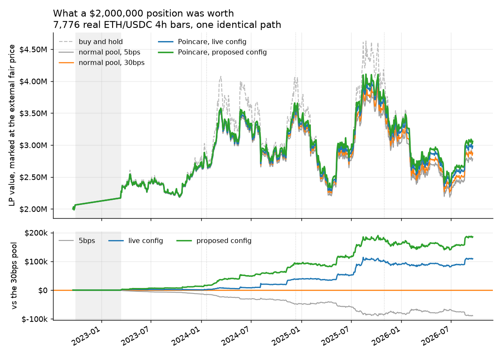

*Fig 9. What a $2,000,000 position was worth. The upper panel is the raw level; because all
three pools track within a few percent across a 2.5x price move, the lower panel is what
actually shows the mechanism working: each pool's difference against the 30bps baseline. The
advantage accumulates steadily rather than arriving in one lucky episode.*

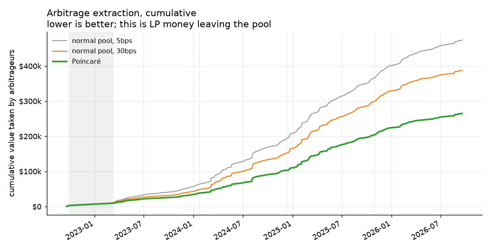

*Fig 10. Cumulative value taken by arbitrageurs. Lower is better; this is LP money leaving the
pool. The ordering is stable for the whole four years.*

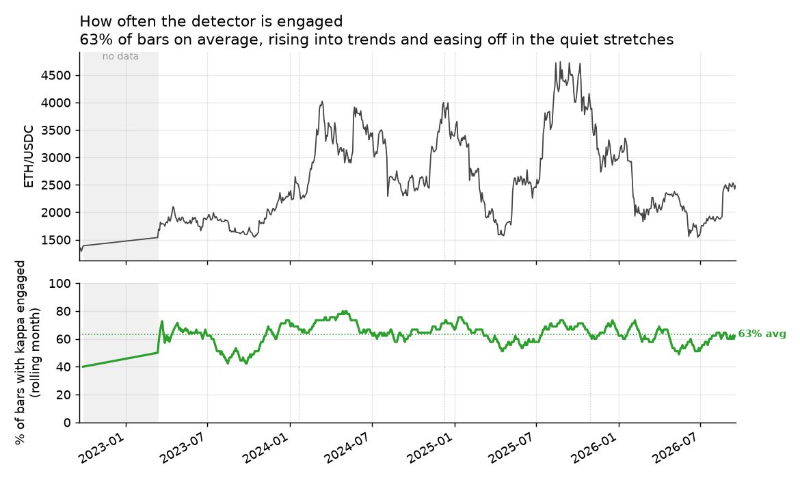

*Fig 11. κ is charged on 63% of bars and on none of the quiet ones. The shaded band is a gap in
the source data (see the caveats below).*

#### Year by year

One four-year number can hide a single lucky episode, so each year was also run as an
**independent pool** seeded at that year's opening price.

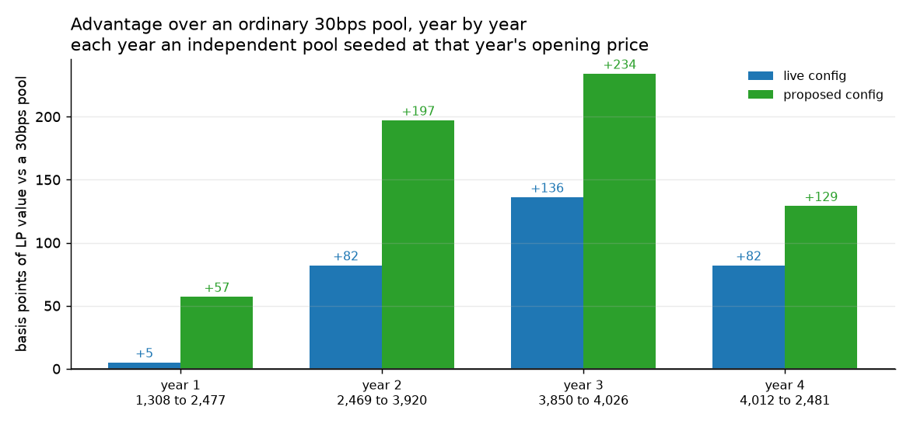

| Period | ETH | Normal 5 bps | Normal 30 bps | Poincaré |
|---|---|---:|---:|---:|
| 2022-09 → 2023-09 | $1,308 → $2,477 | 2,758,501 | 2,774,002 | **2,789,939** |
| 2023-09 → 2024-09 | $2,469 → $3,920 | 2,527,244 | 2,548,570 | **2,598,972** |
| 2024-09 → 2025-09 | $3,850 → $4,026 | 2,052,180 | 2,073,949 | **2,122,610** |
| 2025-09 → 2026-09 | $4,012 → $2,481 | 1,577,711 | 1,590,641 | **1,611,189** |

Ahead in **every year**, through a doubling, a grind sideways, and a 38% drawdown, with less
arbitrage extracted in all four.

---

### 9.4 Why the configuration changed, and what it was read against

The hook first went live in July 2026 with `dFloor = 0.50` and `κ_max = 0.10`. Both moved for
this deployment, to **0.25** and **0.05**. Seven other parameters were swept and deliberately
left alone. This section is the reasoning, because a parameter change with no argument behind it
is just a different guess.

#### The gate was measuring against nothing

`dFloor` gates the detector on the **directional-efficiency** signal

$$D = \frac{\left|\sum_t r_t\right|}{\sum_t \left|r_t\right|} \in [0, 1]$$

and the original 0.50 was chosen as "half way between chop and pure trend", which sounds
principled and is not. `D` is a ratio, and a fixed threshold on a ratio only means something
relative to what the ratio does **under no trend at all**.

For an iid symmetric series of `n` samples the numerator is the absolute value of a random walk,
`E|S_n| = σ√(2n/π)`, and the denominator is `n·E|r| = n·σ√(2/π)`. So the no-trend expectation is

$$\mathbb{E}[D] \;=\; \frac{\sigma\sqrt{2n/\pi}}{n\,\sigma\sqrt{2/\pi}} \;=\; \frac{1}{\sqrt{n}},
\qquad n = \frac{1}{1-\lambda} \ \text{effective samples under EWMA decay } \lambda$$

At the deployed `λ = 0.9` that noise floor is `1/√10 ≈ 0.316`. So the quantity with meaning is
not `dFloor` but its **ratio to the floor**:

$$r \;=\; \frac{\text{dFloor}}{\mathbb{E}[D]} \;=\; \frac{\text{dFloor}}{\sqrt{1-\lambda}}$$

how many noise-widths of directionality the detector demands before it will act. The old gate
sat at `r = 1.58` and spent most real trends waiting. The new one asks `r = 0.79`.

**This also means `dFloor` and `λ` were never independent parameters**, which the sweep
confirms: holding `r = 0.79` fixed while `λ` moves from 0.90 to 0.98 — a five-fold change in
effective window — moves LP value by **under 0.5%**. The derivation breaks exactly where it
predicts it should, at `λ = 0.70` where `n = 3.3` and the central limit theorem has not engaged.
`test/DeployedConfig.t.sol::test_lambdaPairedWithGate` asserts the coupling numerically, so that
retuning `λ` alone cannot silently move the gate.

#### κ_max was halved as a control, not as a second improvement

Dropping the gate roughly doubles how often κ is engaged. On its own that would raise the mean
fee and push traders away — and **a pool that gains LP value by charging more has not improved
anything**, it has just moved along the fee curve. This is the trap that invalidated several
earlier candidates in this study, and the discipline for avoiding it is borrowed directly from
the optimal-fee literature (see below): compare only at a **matched operating point**.

Halving `κ_max` puts the mean fee back where it was — **136 bps against the old 137 bps** — so
what remains is attributable to the detector acting on more real trends rather than to the pool
being more expensive. Reaching the same flow by raising `κ_max` at the *old* gate is worth only
+97 bps; doing it by lowering the gate is worth +255 bps. It is the gating, not the charging.

Halving `κ_max` also **halves the worst-case directional spread**, which tightens the
manipulation bound in [`analysis/OPEN_ITEMS.md`](./analysis/OPEN_ITEMS.md) A3 rather than
relaxing it. The change makes the pool cheaper to trade against in the worst case, not dearer.

#### What did not change, and why that is also a result

| Parameter | Verdict |
|---|---|
| `k` = 0.001, `h` = 0.005 | **Already at a local optimum.** Both directions cost LP value (k: −24 / −45 bps, h: −29 / −36 bps). The original calibration was right. |
| `sMax` = 0.02 | **At the knee.** Flat above (0.04, 0.08 change nothing), sharply worse below (0.01 costs 162 bps). |
| `clip` = 0.20 | **Never binds.** 0.20 and 0.40 give bit-identical results — a 4h log return never reaches 20%. It is a tail guard against one absurd print, not a tuning knob. |
| `λ` = 0.9 | Unchanged, but now **coupled to `dFloor`** by the equation above. |
| `feeGamma` = 0.5, `feeCap` = 30 bps | Unchanged. The vol fee is minor next to the directional spread, but the cap binds nearly always, so it is load-bearing for the mean fee. |
| `alphaWad` = 0 | Curve shaping stays off, and is pinned off by test. |

#### What was read, and what each one changed

The parameter move above is small. Getting to it was not, and most of the reading ended in
rejections, which are recorded here because they are the part that constrains future work.

| Source | What it gave | Outcome |
|---|---|---|
| Milionis, Moallemi, Roughgarden & Zhang — *Loss-Versus-Rebalancing* | The identity that names the cost, and the fact that a static fee does not appear in it at all | **Framing.** Why the lever is state-dependent pricing rather than a fee level |
| Lorden (1971) minimax optimality for CUSUM | The detector's guarantee: minimum worst-case delay for a given false-alarm rate | **Kept.** This is why the engine is CUSUM and not a moving-average crossover |
| Ghasemlu, *Optimal Dynamic Fees for AMMs: A Stochastic Control Approach to LVR* ([arXiv:2606.21769](https://arxiv.org/abs/2606.21769)) | Fees as two opposing forces — revenue per uninformed trade against uninformed volume driven away — and the `ν(f) = ν₀e^{−αf}` flow-elasticity specification | **Method, and a correction.** The harness had no flow elasticity, so every fee increase looked like pure profit and LP value rose without bound. Adding it produced an interior optimum and made "matched operating point" the only fair comparison |
| Gibbs & Candès, *Adaptive Conformal Inference Under Distribution Shift* (NeurIPS 2021) and the JMLR 2024 follow-up | A distribution-free online quantile tracker, `f ← clamp(f + step·(α − err))`, whose coverage bound is an algebraic identity rather than a theorem with hypotheses | **Built, then rejected.** Appeared to beat the deployed config by +906 bps; at a matched operating point it is a wash. The apparent win was the pool shedding 99% of its retail flow |
| Abernethy & Kale, *Adaptive Market Making via Online Learning* (NeurIPS 2013) | Multiplicative weights over a whitelist of configurations, with O(√(T log N)) regret and no distributional assumptions | **Built, then rejected.** Converges correctly to within 0.05% of its best expert, and that expert is no better than the deployed config |
| Self-normalised CUSUM ([arXiv:2509.07112](https://arxiv.org/abs/2509.07112), [arXiv:2210.17353](https://arxiv.org/abs/2210.17353)) | `k` and `h` as multiples of σ̂ rather than absolute log-return units, making the detector scale-free across volatility regimes | **Built, scored exactly +0 bps.** The correct outcome: its value is invariance across regimes this tape does not contain. Worth revisiting for a pair unlike ETH/USDC |
| Avellaneda & Stoikov inventory skew | A derived quote offset, `r = mid − I·γσ²τ` | **Tested, did not beat the shape it would replace.** Also surfaced a units error worth recording: the liquidity term is an absolute price offset, not a fractional fee |
| Path-independence in CFMMs ([arXiv:2604.28017](https://arxiv.org/pdf/2604.28017)) | A modifier must depend on the invariant or the price, never on `x` and `y` separately, or trade-splitting defeats it | **Closed a design.** This is why per-swap re-anchored depth is path-dependent, and part of why curvature is closed (§3.1) |

Two conclusions worth stating plainly. **Three genuinely more sophisticated mechanisms were
built and all three lost** to a two-parameter change once compared honestly — which is a result
about the comparison discipline as much as about the mechanisms. And **the only thing that
actually moved the number was a two-line calculation about what `D` does under no trend**, which
needed no new machinery at all.

#### Caveats, stated plainly

- **Year 1 is the weak one, and it is instructive.** Poincaré beat an ordinary 30bps pool by
  57 bps that year, its worst, despite ETH nearly doubling. Year 3 went almost nowhere and it did
  its best work. What the detector is paid for is **sustained directional runs, not net
  displacement**, and those are not the same thing. This is not a bull-market product.
- **The source data has one hole.** 2022-09-29 to 2023-03-12, 3,940 hours, which the replay is
  forced to treat as a single 4h step from $1,338 to $1,552. Re-running from past it
  (`test_gapExcluded`) gives +631 bps instead of +644 — the level shifts by 13 bps and no
  conclusion changes.
- **This is 4-hour bars; the hook samples per block.** Four orders of magnitude in arrival rate.
  The scale-free *relationships* carry over — `r`, and the σ-normalised thresholds. `κ_max` does
  not transfer the same way, and we **tried and failed** to derive the per-block value from this
  data; see [`analysis/OPEN_ITEMS.md`](./analysis/OPEN_ITEMS.md) M. `κ_max = 0.05` stands on its
  security argument, which does not depend on cadence: lower is strictly safer.
- **Flow elasticity is modelled, not fitted.** `α = 400` in `ν(f) = ν₀e^{−αf}` is the shape the
  literature uses; it is not fitted to Poincaré's own traders, because there is not yet enough
  live flow to fit it against. Every "at matched flow" verdict above leans on it.
- **The pool keeps 3 percentage points less flow** than the old configuration (31.16% vs
  34.12%). LP value already nets the lost fee revenue, so the +644 bps stands, but in a
  competitive market that is volume going elsewhere. Worth noting that the 5 bps pool keeps
  **82%** of flow and still ends with the *least* LP value of the three: retaining traders is not
  the objective function.

Reproduce any of it:

```bash
# the table, the year-by-year rows, and the parameter sweeps
POINCARE_SWEEP=1 FOUNDRY_PROFILE=sweep forge test \
    --match-path test/optimal/GammaFourYear.t.sol -vv

# regenerate the figures from the same run
FOUNDRY_PROFILE=sweep forge test --match-path test/optimal/GammaFourYear.t.sol \
    --match-test test_dumpTimeseries
python analysis/simulation/plot_fouryear.py
```

## 10. Roadmap

> **Status:** the MVP described above is **built and green**, 228 passing Foundry tests (unit,
> fuzz, TWO invariant flavors — plain and full-feature — at 128k randomized calls each,
> end-to-end manipulation sims including σ-inflation, native-ETH coverage, gas, and a
> regression test per finding from the **Olympix security review**, all fixed). The
> items below are what remains to go from MVP to production.

**Live on Unichain Sepolia** (chain id 1301, testnet only, no real funds at risk): hook
`0xa5ABa524A96695Dc4E36BacfF3048aD2F24AAa88`, Lens `0x5d360309c7564270c5604067d7fa85e7d2508e02`,
deployed at block 62883477 against the canonical v4 `PoolManager`
`0x00B036B58a818B1BC34d502D3fE730Db729e62AC`, with a demo WETH/USDC pool, a faucet, and a
web app (`frontend/`) that trades, provides liquidity, and charts the detector's real
`DetectorSample` trace block by block. Addresses of record:
`deployments/unichain-sepolia.json`.

**Security review:** the contracts were reviewed by **Olympix** under the **Uniswap Foundation
Security Fund**. Every reported finding was fixed and each has a regression test that fails on
the pre-fix code and passes now (`test/regression/OlympixFindings.t.sol`, plus the log-domain
cases in `PriceLib.t.sol`). Full finding table in [§11](#11-security-review). An independent
external audit is still required before mainnet (item 5 below).

**Built (MVP + the 2026-07 feature pass):** the directional-spread pricing engine + `beforeSwapReturnDelta` accounting; the directional-efficiency signal and two-sided CUSUM detector (`h` from a target false-alarm rate, not a block count); the bounded, rate-limited control law + safety layer; the back-test (LVR vs constant-product **and** vs a vol-fee baseline, plus the manipulation-cost study); the Quoter/Lens (quotes match execution to the wei, **including in a fresh block**, via the hook's own detector projection); the **v2 adaptive (σ-normalized) detector mode** with the Huber-clipped robust increment (§9.2); the **vol-scaled base fee** `min(γ·σ̂, cap)` — calm-market LP revenue generated from realized volatility, never a constant; the **deep symmetric calm base** (supply-scaled virtual offsets, the arb-safe E0 parameterisation); the **`DetectorSample` per-block trace event** (S⁺/S⁻, D, σ̂, κ, fee — the frontend charts the real statistics from it); packed detector storage (~96k gas per sampled block, event included); **native-ETH pair support**; the Olympix review fixes with their regression suite; a **plain-English narration of the live detector state** on the Analytics screen, generated server-side with a deterministic local fallback; and the full Foundry suite.

**Next, to production:**

1. ~~**Real-data calibration**~~ **Done (2026-09).** Four years of ETH/USDC, every parameter
   swept one at a time; `dFloor` and `κ_max` recalibrated, the rest confirmed already optimal.
   Numbers and figures in [§9.3](#93-four-years-of-real-ethusdc); the reasoning and the papers
   it was read against in [§9.4](#94-why-the-configuration-changed-and-what-it-was-read-against).
2. **Adaptive-mode manipulation bound (OPEN_ITEMS V1):** the v2 detector is implemented and
   simulated against σ-inflation, but the quantitative worst-case bound must be derived before
   `adaptive = true` guards real value. Security params (`κ_max, Δκ_max`) stay fixed by design.
3. **Derive `dFloor` on chain from `r` and `λ`** rather than taking it as a constructor
   argument. §9.4 shows the two are one parameter, `dFloor = r·√(1−λ)`; deriving it makes
   the whole class of "someone retuned `λ` and forgot the gate" impossible rather than merely
   asserted in a test.
4. **Router / aggregator integration** through the Lens, plus multi-pool coverage.
5. **External security audit** before mainnet.

> **Not on this roadmap, and deliberately:** a depth or curvature lever. It was built,
> made round-trip safe and split-invariant, measured across four years, and lost by roughly
> thirty to one. It is closed. There is no depth-asymmetry mode in the codebase, no
> configuration that enables one, and no plan to add one. Evidence kept in
> [`analysis/OPEN_ITEMS.md`](./analysis/OPEN_ITEMS.md) E1 so the decision stays auditable.

## 11. Security review

Poincaré was selected by the **Uniswap Foundation Security Fund**, which sponsored a security
review by **Olympix**. The review ran across the full contract surface (58 source units) and
reports only what it can demonstrate: each finding arrives as a runnable Foundry proof of
concept rather than a pattern match.

**Nine findings, zero high-severity, all fixed.** Seven fixes cover the nine, because two pairs
shared a root cause. Every fix ships with a regression test that fails on the pre-fix code and
passes now, in `test/regression/OlympixFindings.t.sol` plus the log-domain cases in
`PriceLib.t.sol`.

**What the review covered, and what came after it.** The review ran on the 2026-07 build. Two
things changed in the repository since, and the distinction matters when reading "reviewed"
above:

- **Shadow-accounted reserves** are a genuine change to contract logic, made *after* the review
  and not covered by it. They exist *because* of the review: they close the Low-severity claim
  donation finding below. The risk the change itself introduces is set out in
  [`SECURITY.md`](./SECURITY.md), and `invariant_shadowReservesBackedByClaims` asserts the
  shadow never exceeds the ERC-6909 claims backing it across 128k randomized calls.
- **The 2026-09 recalibration changed no contract code at all.** `dFloor` and `κ_max` are
  constructor arguments; the deployed bytecode's logic is unchanged by them, and the new values
  sit strictly inside the bounds the existing `isValidConfig` check already enforced. Halving
  `κ_max` in particular *reduces* the worst-case directional spread, so it tightens the
  manipulation bound rather than relaxing it.

So: the contracts were reviewed, every finding was fixed, and the currently deployed build
carries one post-review logic change that was itself a fix. None of that substitutes for an
independent audit, which is still required before mainnet.

| Severity | Finding | Fix |
|---|---|---|
| Medium | A native-ETH payout recipient could reenter a swap mid-withdrawal and price against half-settled reserves | Transient `_liquidityLock` held across the whole add/remove including settlement; `_beforeSwap` reverts while it is set |
| Medium | LP shares were priced off token0 while the token1 counterpart floored down, minting claims token1 never backed | Shares priced off the scarcer funded side (`min` of both ratios); zero-counterpart adds rejected |
| Low | The Lens returned a quote for a zero amount that a real swap reverts on | The Lens mirrors the PoolManager's `SwapAmountCannotBeZero` guard, so quotes stay execution-faithful |
| Low ×2 | An extreme move could push `lnWad` outside its domain, letting the detector revert a swap and violating the never-revert rule (§4.5) | The ratio is clamped into the safe domain, and a mid that floors to zero skips the sample instead of reverting |
| Low ×2 | The docs claimed full donation resistance, but ERC-6909 claims are transferable, so a claim donation can move `_reserves()` | **Closed.** Reserves are now shadow-accounted: the hook books every amount it settles, so a donation moves nothing it prices from. See [`SECURITY.md`](./SECURITY.md) |
| Low | A first deposit small enough to floor one anchored virtual offset to zero anchors the curve off the seeded ratio, opening an arb seam | Seeds where either offset rounds to zero are rejected |
| Low | Exact-out routing could dodge part of the directional spread, because marking up the input undercharges on a convex curve | Exact-out reimplemented as the exact inverse of the exact-in haircut |

Finding, fix and test are mapped one to one in [`SECURITY.md`](./SECURITY.md) and tracked in
[`analysis/OPEN_ITEMS.md`](./analysis/OPEN_ITEMS.md) §H.

**What this does not mean.** A sponsored review is not a full external human audit, and we do not
present it as one. An independent audit remains required before mainnet, and stays open as item
A9 in the tracker.

---

## 12. External dependencies

**None that carry trust.** The detector works with no oracle, no AVS, no keeper, no relayer and
no cross-chain dependency. Its only input is the pool's own reserve-implied price, sampled once
per block inside `beforeSwap`. Adding an external price feed would reintroduce exactly the trust
and latency assumptions a quickest-change detector exists to avoid, so the absence is the design
rather than a gap in it.

What it does build on is standard, public infrastructure. The repository was scaffolded from
Uniswap's official [`v4-template`](https://github.com/Uniswap/v4-template), and the contracts
depend on Uniswap v4 (`v4-core`, `v4-periphery`), OpenZeppelin's `uniswap-hooks`
`BaseCustomCurve` for settlement, `hookmate` for router and address constants, and Solady for
fixed-point math. Everything specific to Poincaré, meaning `Cusum`, `DirectionalSignal`,
`ControlLaw`, `AsymmetricCurve`, `PriceLib`, `PoincareHook` and `PoincareLens`, is written from
scratch.

---

## 13. License

Poincare is licensed under the **Business Source License 1.1** (`BUSL-1.1`) — see [LICENSE](./LICENSE).
Production/commercial use of the hook, detector, curve, or any derivative requires a commercial
license from the Licensor until the Change Date (2030-07-19), after which the code converts to MIT.
Review, testing, and security research are permitted. Licensing contact: srivastavaprakhar3010@gmail.com.
