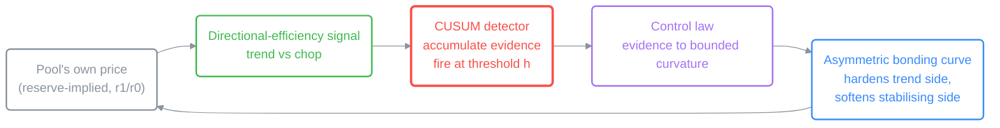
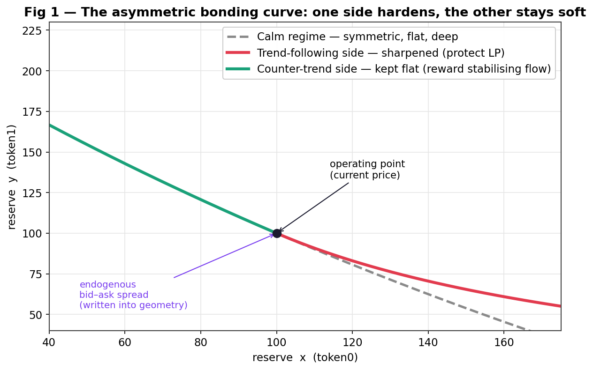
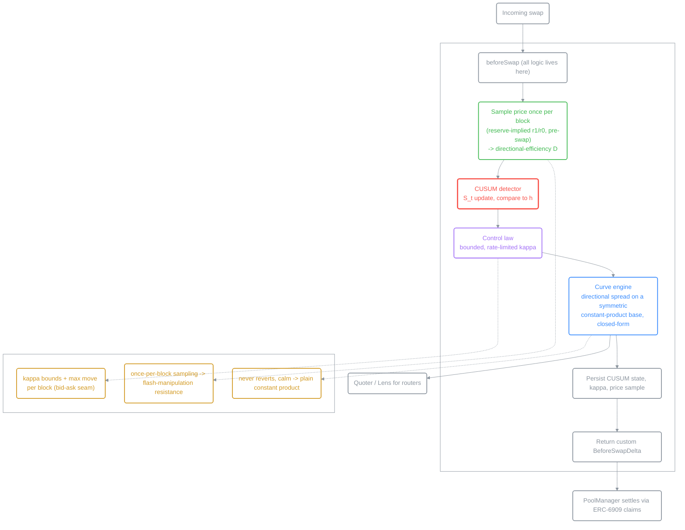
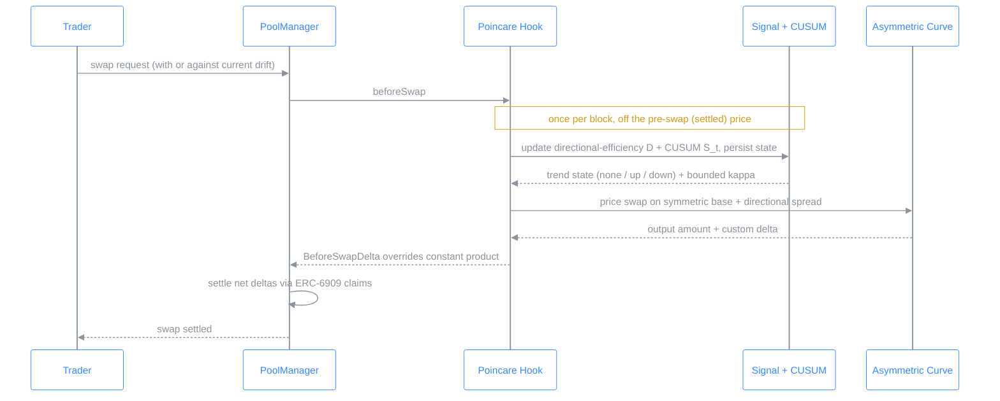
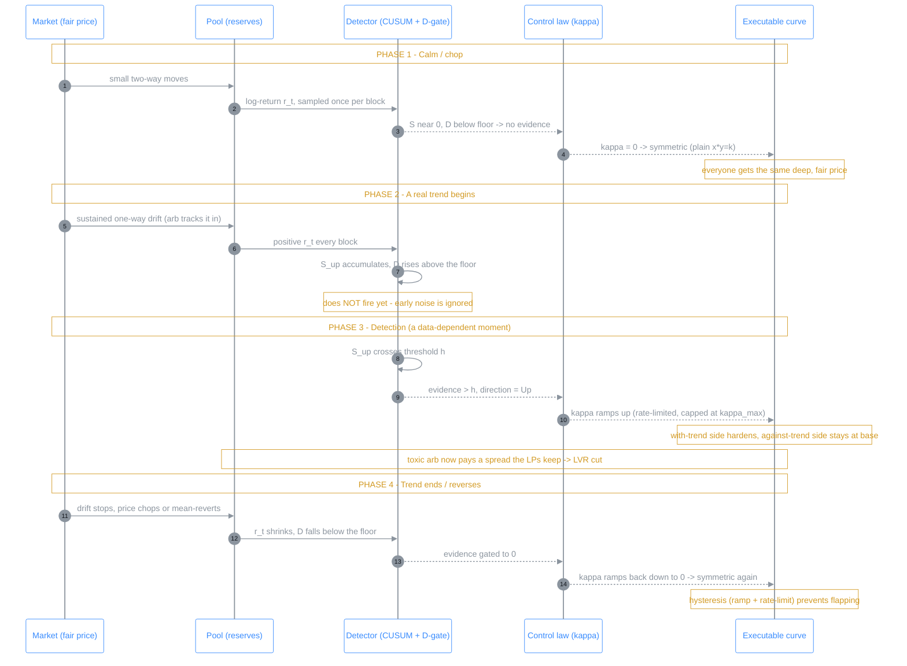
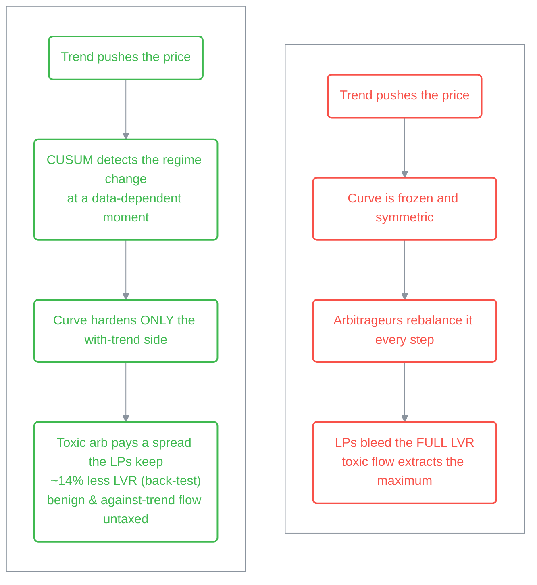

# POINCARÉ

### An adaptive Uniswap v4 AMM that detects real price trends with a provably-optimal change-detector and leans its bonding curve against them, protecting liquidity providers from the losses that trends cause, without an oracle.

**Built for the Uniswap Hook Incubator 10 (UHI10) hookathon.** The repository was scaffolded
from Uniswap's official [`v4-template`](https://github.com/Uniswap/v4-template); the detector,
control law, curve, hook and Lens are original work.
**Partner integrations: none** — deliberately, see [§11](#11-partner-integrations).

---

## TL;DR

A normal AMM is a frozen curve: it quotes the same way whether the market is drifting hard in one direction (when liquidity providers bleed value to arbitrageurs) or just chopping around harmlessly. Poincaré watches its own price, runs a **CUSUM quickest-change detector** to decide, with mathematically optimal speed, whether a *genuine* directional trend has begun, and when one has, it **bends its bonding curve asymmetrically**: it hardens the side the trend is pushing (where LPs lose money) and stays cheap and open on the stabilising side (rewarding the flow that helps).

The detector fires at a **data-dependent moment**, not after a fixed number of blocks, so there is no countdown for an attacker to game. And because the only way to fool the detector is to *genuinely move the market* (spending real money and feeding arbitrageurs), manipulation is bounded by design, not wished away.

**What it uses:** the *Milionis LVR identity* (why curvature is the lever), an *asymmetric hyperbolic bonding curve* (the actuator, shipped as an arb-safe directional spread; see §3.1), a *directional-efficiency signal*, and *CUSUM / Quickest Change Detection* with *Lorden minimax optimality* (the engine), with *robust-QCD* hardening on the roadmap.

---

## 1. The problem

Liquidity providers lose value to better-informed flow whenever the price moves, a cost with a precise name, **Loss-Versus-Rebalancing (LVR)**. The Milionis–Moallemi–Roughgarden–Zhang identity pins it down:

$$\text{LVR rate} \;\approx\; \tfrac{1}{2}\,\sigma^2 \cdot \big(\text{marginal liquidity}\big)$$

Two truths fall out of that one line:

- **Curvature is the lever.** "Marginal liquidity" is a property of the curve's *shape*. A flat curve bleeds more LVR; a sharp curve bleeds less. The *fee* is not in this equation, so fee-tweaking, which most hooks do, is pulling the wrong lever.
- **The damage is directional.** LVR is driven by *sustained, one-directional* price moves, not by symmetric noise. A market that thrashes around but goes nowhere barely hurts LPs; a market that *trends* is what drains them.

So the right response is: **reshape the curve's curvature, asymmetrically, but only when a real trend is actually happening.** That last clause is the hard part, and the whole project.

---

## 2. The design in one picture

Poincaré has two parts: a **detector** (the brain) that decides *when* there is a real trend, and an **actuator** (the curve) that *acts* on that decision.

```mermaid
%%{init: {'theme':'base','themeVariables':{'fontFamily':'ui-monospace, monospace','primaryColor':'transparent','primaryTextColor':'#388bfd','primaryBorderColor':'#8b949e','lineColor':'#8b949e','tertiaryColor':'transparent','clusterBkg':'transparent','clusterBorder':'#8b949e'}}}%%
flowchart LR
    PRICE("Pool's own price<br/>(reserve-implied, r1/r0)") --> SIG("Directional-efficiency signal<br/>trend vs chop")
    SIG --> CUSUM("CUSUM detector<br/>accumulate evidence<br/>fire at threshold h")
    CUSUM --> LAW("Control law<br/>evidence to bounded curvature")
    LAW --> CURVE("Asymmetric bonding curve<br/>hardens trend side,<br/>softens stabilising side")
    CURVE --> PRICE
    classDef io stroke:#8b949e,color:#8b949e,stroke-width:2px;
    classDef sig stroke:#3fb950,color:#3fb950,stroke-width:2px;
    classDef engine stroke:#f85149,color:#f85149,stroke-width:3px;
    classDef law stroke:#a371f7,color:#a371f7,stroke-width:2px;
    classDef curve stroke:#388bfd,color:#388bfd,stroke-width:2px;
    class PRICE io;
    class SIG sig;
    class CUSUM engine;
    class LAW law;
    class CURVE curve;
```

The novelty is the **detector**: no AMM in the Uniswap hook ecosystem uses change-point detection. The asymmetric curve is just where its decision lands.

---

## 3. The mathematics we use

### 3.1 The actuator: an asymmetric hyperbolic curve

A constant-product pool is the hyperbola `x·y = k`. The natural way to make it *asymmetric* is to generalise it with **direction-dependent virtual offsets**: small offsets for the with-trend side (a steep, shallow curve, heavy impact) and large offsets for the stabilising side (a flat, deep curve):

$$\big(x + a_{\pm}\big)\big(y + b_{\pm}\big) = K$$

This is the design the figure below illustrates, and it is where we started.

> **Why we did *not* ship raw direction-dependent offsets, and what we ship instead.**
> Choosing *different depths* per swap direction and re-anchoring at the current reserves on every swap is **arbitrage-exploitable**. We reproduced it as a concrete round-trip drain: buy on the shallow branch, sell back on the deep branch, and walk away with pool value. The root cause is that depth-asymmetry shifts the **mid-price**, not just the spread, which opens a free round trip, a hole an MEV bot empties on day one.
>
> The fix, and what the MVP actually implements, is to put the asymmetry **in the slope, not the depth**: a **non-negative directional spread** layered on a *single, symmetric* base curve. The with-trend (toxic) side is charged a spread `κ` the LP keeps; the against-trend (stabilising) side trades at the base price. Because the spread only ever *worsens* the trader's execution and sits on a symmetric base, **every round trip is strictly unprofitable by construction** (proven by fuzzing and a 384k-op invariant), yet the two executable branches still meet at the current price, giving the **endogenous bid–ask spread written into the geometry** that a professional market maker maintains. The richer depth/curvature lever stays on the roadmap, gated on the manipulation-cost sizing it would require (§3.4, §7).

*Fig 1. Conceptual view. In calm markets the curve is symmetric and deep (grey). When a real up-trend is detected, the executable price hardens on the trend-following side (red) and stays at the base on the counter-trend side (green). The kink at the operating point is a real, dynamic bid–ask spread, and in the shipped MVP that kink is the directional **spread**, not a depth change.*

### 3.2 The signal: directional efficiency

We measure how *trending* the recent path is with a directional-efficiency ratio (a cheap, on-chain proxy for the Hurst exponent):

$$D \;=\; \frac{\big|\,P_{\text{now}} - P_{\text{window start}}\,\big|}{\sum_i \big|\,P_i - P_{i-1}\,\big|} \;\in\; [0,1]$$

Near **1** the price marched one way (trend); near **0** it moved a lot but went nowhere (chop). This feeds the detector.

### 3.3 The engine: CUSUM / Quickest Change Detection

This is the heart. The question "has a *real* regime change (a trend) started, and how fast can I be sure without crying wolf on noise?" is the mathematics of **Quickest Change Detection**, and its optimal workhorse is the **CUSUM** statistic (Page, 1954). It recursively accumulates the evidence and fires when it crosses a threshold:

$$S_t \;=\; \max\!\big(0,\; S_{t-1} + (\ell_t - k)\big), \qquad \text{alarm when } S_t \ge h$$

where `ℓ_t` is the per-step increment, `k` is a slack constant, and `h` is the only real knob, set by the tolerable **false-alarm rate**, *not* by a hard-coded number of blocks. The MVP uses the **Gaussian-form increment** `ℓ_t = r_t` (the signed log-return), the standard CUSUM workhorse; the heavy-tailed **log-likelihood-ratio** variant is the §3.4 roadmap item.

Why this is the right tool, and not a heuristic:

- **The firing moment is a *stopping time*: data-dependent and unpredictable.** A strong, real trend crosses `h` fast; weak noise never does. There is no fixed "after N blocks" for an attacker to exploit.
- **It is provably optimal.** CUSUM is asymptotically optimal under **Lorden's minimax criterion**: it minimises the worst-case delay to detect a true change for any given false-alarm rate. That is the best-possible resolution of the "react fast vs don't get fooled" tension.

### 3.4 The hardening: robust / minimax QCD *(clip shipped; full minimax analysis on the roadmap)*

The attacker who tries to fool the detector is itself a studied problem. **Minimax-robust QCD** designs the test against worst-case (least-favourable) distributions, and the **covert-adversary-vs-CUSUM** results let us *quantify* how costly it is to delay or trigger the detector.

**What the MVP actually relies on for manipulation resistance** is not the robust increment (that is the heavy-tailed roadmap upgrade) but three concrete, *implemented* layers, proven in the test-suite (§4.2, §4.4): (1) the **data-dependent firing time** removes any countdown to game; (2) the **bounded, one-sided spread** means the soft side trades at the base price, so faking a trend yields **zero** extractable advantage on the other side (`max_soft_gain ≡ 0`); and (3) **arbitrage** makes genuinely moving the price costly (`min_trigger_cost > 0`). The robust-QCD increment hardens layer (1) further against heavy-tailed crypto returns and is the next detector upgrade; see **§9.2** for the self-normalizing, self-calibrating **v2** that builds on it (thresholds expressed in units of the live volatility σ, so they adapt to the market automatically).

### 3.5 The control law: evidence to bounded curvature

The detector's accumulated evidence sets the curve's asymmetry, **bounded** so it can never swing far enough to be worth gaming:

$$\kappa \;=\; \text{clamp}\big(f(S_t),\; \kappa_{\min},\; \kappa_{\max}\big)$$

*Fig 4. Below the detection threshold the curve stays symmetric and deep. Past it, asymmetry ramps up but is hard-capped, so the most an attacker could ever gain on the soft side is smaller than the cost of triggering the detector.*

---

## 4. How it works: the full lifecycle

### 4.1 Architecture

```mermaid
%%{init: {'theme':'base','themeVariables':{'fontFamily':'ui-monospace, monospace','primaryColor':'transparent','primaryTextColor':'#388bfd','primaryBorderColor':'#8b949e','lineColor':'#8b949e','tertiaryColor':'transparent','clusterBkg':'transparent','clusterBorder':'#8b949e'}}}%%
flowchart TD
    SWAP("Incoming swap") --> BS("beforeSwap (all logic lives here)")
    subgraph HOOK["Poincare Hook"]
        BS --> EST("Sample price once per block<br/>(reserve-implied r1/r0, pre-swap)<br/>-> directional-efficiency D")
        EST --> DET("CUSUM detector<br/>S_t update, compare to h")
        DET --> LAW("Control law<br/>bounded, rate-limited kappa")
        LAW --> INV("Curve engine<br/>directional spread on a symmetric<br/>constant-product base, closed-form")
        INV --> PERSIST("Persist CUSUM state, kappa, price sample")
        PERSIST --> DELTA("Return custom BeforeSwapDelta")
    end
    DELTA --> SETTLE("PoolManager settles via ERC-6909 claims")
    subgraph SAFETY["Safety layer"]
        BND("kappa bounds + max move per block (bid-ask seam)")
        ROB("once-per-block sampling -> flash-manipulation resistance")
        CB("never reverts, calm -> plain constant product")
    end
    EST -.-> ROB
    LAW -.-> BND
    INV -.-> CB
    INV --> LENS("Quoter / Lens for routers")
    classDef io stroke:#8b949e,color:#8b949e,stroke-width:2px;
    classDef sig stroke:#3fb950,color:#3fb950,stroke-width:2px;
    classDef engine stroke:#f85149,color:#f85149,stroke-width:3px;
    classDef law stroke:#a371f7,color:#a371f7,stroke-width:2px;
    classDef curve stroke:#388bfd,color:#388bfd,stroke-width:2px;
    classDef safety stroke:#d29922,color:#d29922,stroke-width:2px;
    class SWAP,BS,PERSIST,DELTA,SETTLE,LENS io;
    class EST sig;
    class DET engine;
    class LAW law;
    class INV curve;
    class BND,ROB,CB safety;
```

### 4.2 A swap, step by step

```mermaid
%%{init: {'theme':'base','themeVariables':{'fontFamily':'ui-monospace, monospace','actorBkg':'transparent','actorBorder':'#388bfd','actorTextColor':'#388bfd','actorLineColor':'#8b949e','signalColor':'#8b949e','signalTextColor':'#8b949e','noteBkgColor':'transparent','noteBorderColor':'#d29922','noteTextColor':'#d29922','activationBkgColor':'transparent','activationBorderColor':'#8b949e','sequenceNumberColor':'#0d1117'}}}%%
sequenceDiagram
    participant T as Trader
    participant PM as PoolManager
    participant H as Poincare Hook
    participant E as Signal + CUSUM
    participant I as Asymmetric Curve

    T->>PM: swap request (with or against current drift)
    PM->>H: beforeSwap
    Note over H,E: once per block, off the pre-swap (settled) price
    H->>E: update directional-efficiency D + CUSUM S_t, persist state
    E-->>H: trend state (none / up / down) + bounded kappa
    H->>I: price swap on symmetric base + directional spread
    I-->>H: output amount + custom delta
    H-->>PM: BeforeSwapDelta overrides constant product
    PM->>PM: settle net deltas via ERC-6909 claims
    PM-->>T: swap settled
```

### 4.3 Lifecycle on a *real* trend

A pool is deployed with the hook. Swaps begin. While the market only chops, the directional-efficiency signal stays low, the CUSUM statistic hovers near zero, and **the curve stays symmetric and deep, best-in-class execution for everyone.** Then a genuine trend begins. The CUSUM statistic starts climbing as evidence accumulates; it does *not* fire on the first few trades (that would be crying wolf). Only when the evidence crosses the threshold (a moment that depends on how strong the trend is, not on a fixed clock) does the regime flip and the curve begin to lean against the trend.

*Fig 2. Top: the pool price, calm then trending. Middle: the CUSUM statistic accumulating evidence and crossing the threshold at a data-dependent moment. Bottom: the curve's asymmetry, flat until detection, then ramping up to lean against the trend. Notice the detector ignores the early noise and only commits when the evidence is real.*

### 4.4 What happens when someone fakes a trend

This is the crux, and the figure makes it concrete. To push the CUSUM statistic to its threshold, an attacker cannot simply *signal* a trend; they must **actually move the price**, with real buys and real money. But moving the price away from fair value opens an arbitrage gap, and arbitrageurs immediately trade against them, capping the move and snapping it back the moment the attacker stops. So the attacker's cost climbs the whole time, and the unwind hands their losses straight to the arbitrageurs.

*Fig 3. Top: the attacker genuinely pumps the price (real money), and arbitrageurs snap it back when they stop. Middle: the CUSUM does cross, but only because the price truly moved, which the attacker paid for. Bottom: the attacker's mounting cost. The "fake" trend was never fake; it was a real, expensive market move. Combined with the bounded asymmetry (Fig 4), the soft-side advantage they could capture is held below this cost, so the attack does not pay.*

The defence is therefore three layers working together: the **data-dependent CUSUM** removes the predictable countdown, the **bounded asymmetry** caps the prize, and **natural arbitrage** punishes anyone who tries to manufacture the move.

### 4.5 The full lifecycle, and how it differs from a normal pool

This is the heart of the novelty in one picture: one pool walked through an entire regime cycle (calm, a real trend, detection, the lean, and the return to calm), showing exactly *when* and *why* the curve changes.

```mermaid
%%{init: {'theme':'base','themeVariables':{'fontFamily':'ui-monospace, monospace','actorBkg':'transparent','actorBorder':'#388bfd','actorTextColor':'#388bfd','actorLineColor':'#8b949e','signalColor':'#8b949e','signalTextColor':'#8b949e','noteBkgColor':'transparent','noteBorderColor':'#d29922','noteTextColor':'#d29922','activationBkgColor':'transparent','activationBorderColor':'#8b949e','sequenceNumberColor':'#0d1117'}}}%%
sequenceDiagram
    autonumber
    participant M as Market (fair price)
    participant P as Pool (reserves)
    participant D as Detector (CUSUM + D-gate)
    participant K as Control law (kappa)
    participant C as Executable curve

    Note over M,C: PHASE 1 - Calm / chop
    M->>P: small two-way moves
    P->>D: log-return r_t, sampled once per block
    D-->>K: S near 0, D below floor -> no evidence
    K-->>C: kappa = 0 -> symmetric (plain x*y=k)
    Note over C: everyone gets the same deep, fair price

    Note over M,C: PHASE 2 - A real trend begins
    M->>P: sustained one-way drift (arb tracks it in)
    P->>D: positive r_t every block
    D->>D: S_up accumulates, D rises above the floor
    Note over D: does NOT fire yet - early noise is ignored

    Note over M,C: PHASE 3 - Detection (a data-dependent moment)
    D->>D: S_up crosses threshold h
    D-->>K: evidence > h, direction = Up
    K-->>C: kappa ramps up (rate-limited, capped at kappa_max)
    Note over C: with-trend side hardens, against-trend side stays at base
    Note over P,C: toxic arb now pays a spread the LPs keep -> LVR cut

    Note over M,C: PHASE 4 - Trend ends / reverses
    M->>P: drift stops, price chops or mean-reverts
    P->>D: r_t shrinks, D falls below the floor
    D-->>K: evidence gated to 0
    K-->>C: kappa ramps back down to 0 -> symmetric again
    Note over C: hysteresis (ramp + rate-limit) prevents flapping
```

**Side by side, on the very same trend**, against a normal constant-product pool:

```mermaid
%%{init: {'theme':'base','themeVariables':{'fontFamily':'ui-monospace, monospace','primaryColor':'transparent','primaryTextColor':'#388bfd','primaryBorderColor':'#8b949e','lineColor':'#8b949e','tertiaryColor':'transparent','clusterBkg':'transparent','clusterBorder':'#8b949e'}}}%%
flowchart TB
    subgraph NORMAL["A normal constant-product pool"]
        direction TB
        N1("Trend pushes the price") --> N2("Curve is frozen and symmetric")
        N2 --> N3("Arbitrageurs rebalance it every step")
        N3 --> N4("LPs bleed the FULL LVR<br/>toxic flow extracts the maximum")
    end
    subgraph POIN["The Poincare pool"]
        direction TB
        Q1("Trend pushes the price") --> Q2("CUSUM detects the regime change<br/>at a data-dependent moment")
        Q2 --> Q3("Curve hardens ONLY the with-trend side")
        Q3 --> Q4("Toxic arb pays a spread the LPs keep<br/>~14% less LVR (back-test)<br/>benign & against-trend flow untaxed")
    end
    classDef bad stroke:#f85149,color:#f85149,stroke-width:2px;
    classDef good stroke:#3fb950,color:#3fb950,stroke-width:2px;
    class N1,N2,N3,N4 bad;
    class Q1,Q2,Q3,Q4 good;
```

A normal pool cannot tell a trend from chop, so it offers the same terms to toxic and benign flow alike and pays the full LVR. Poincaré spends a small, bounded spread *only* on the flow that is actually hurting LPs, *only* while a real trend is confirmed, and routes it back to the LPs.

---

## 5. Why it benefits everyone

- **Liquidity providers** keep the value that normally leaks to arbitrageurs during trends, *and*, unlike a symmetric defence, keep their fee volume, because only the toxic side is hardened while the benign side stays open.
- **Traders** stabilising the pool (trading against the drift) trade at the **full base price with no spread**: they are never charged for the trend, while toxic with-trend flow is; ordinary traders in calm markets see the symmetric base curve.
- **Routers / aggregators** prefer it for exactly that reason (better execution on the flow it welcomes), and a first-class Quoter/Lens makes the custom curve easy to integrate.

It does not make liquidity provision risk-free: the LP still holds the assets and feels genuine market moves. It removes the *avoidable* arbitrageur tax (the LVR), not the underlying exposure.

---

## 6. Scope and honest restrictions

- **Two-asset pairs**, and it is built for **volatile, free-floating pairs** (ETH/USDC, ETH/BTC, volatile majors) where directional LVR dominates.
- **Calm and pegged pairs are handled gracefully**: low signal keeps the curve symmetric with the spread at zero (plain constant-product execution for everyone); a sudden depeg is just a detected trend the curve leans into. (A deep, stableswap-like *base* curve is a roadmap option, since the curve engine already supports virtual offsets; the MVP uses a constant-product base.)
- **Liquidity- and flow-sensitive.** Deployable on long-tail pools, safest where there is real depth and a clean price series for the detector.
- The detector raises and *bounds* the cost of manipulation; it does not claim to make it impossible. The manipulation-cost analysis is a first-class deliverable, not a footnote.

---

## 7. Why this is not a copy

The asymmetric-curve idea alone would resemble the directional-fee family (Nezlobin and its descendants). What makes Poincaré a different object is the **engine**: a **Quickest-Change-Detection trend detector** governs *when* it acts. A scan of the entire 562-hook UHI directory and the UHI9 winners returns **zero** uses of CUSUM, change-point detection, SPRT, or quickest detection; the signals in use are simple EWMAs, TWAPs, and imbalance thresholds with fixed cut-offs, precisely what an attacker can game. Poincaré is, to our knowledge, the **first AMM whose regime-switching is governed by a provably-optimal sequential change detector, firing at a data-dependent moment no attacker can precompute.** The curve is the actuator; the detector is the contribution.

| Axis | Existing hooks | **Poincaré** |
|---|---|---|
| Lever | fee / spread / static curve | **asymmetric geometry: a directional, trend-gated spread (arb-safe); depth/curvature lever on the roadmap** |
| Trigger | fixed window / threshold / oracle | **CUSUM stopping time (data-dependent)** |
| Optimality | heuristic | **Lorden minimax-optimal detection** |
| Manipulation | hopes the signal is hard to fake | **bounded prize (soft-gain ≡ 0) + arbitrage punishment; robust-QCD on the roadmap** |
| External deps | oracle / AVS / keeper | **none, self-contained** |

---

## 8. Integration: routing and best-fit pairs

**Will routers find it, and will they pick it?** A Poincaré pool is a normal Uniswap v4 pool from the `PoolManager`'s point of view, discoverable like any other. The one subtlety every custom-curve hook shares: the **vanilla v4 Quoter cannot price it**, because it assumes the canonical `x·y=k` math and would mis-quote our curve. That is exactly what the first-class **`PoincareLens`** is for: it prices off the *same* libraries the swap path uses, so any router or aggregator that quotes through the Lens (or simulates the swap) gets the correct number. Integration therefore means "quote via the Lens," not "trust the default quoter."

Given correct quotes, selection is a **feature of the design, not a hope**:

- For **calm-market and against-trend (stabilising) flow**, Poincaré quotes the *full base price with no spread*, competitive with, and often better than, a pool charging a static or vol-scaled fee. Best-execution routers will pick it for exactly this flow.
- For **with-trend (toxic) flow during a confirmed trend**, Poincaré deliberately quotes *worse* (the spread). Routers send that flow elsewhere, which is the point: the pool sheds the flow that costs LPs money and keeps the flow that doesn't.

So the routing dynamics are self-selecting: Poincaré wins the benign/stabilising order flow and declines the toxic flow, which is precisely the LP-favourable split.

**Which pairs does it work best for?**

- **Best:** liquid, free-floating, **volatile majors with real trend episodes amid calm**: ETH/USDC, ETH/BTC, major L1/L2 tokens vs a stable. This is where directional **LVR dominates**, where the detector has a clean, deep price series, and where genuine manipulation is expensive, the exact regime the back-test models.
- **Graceful but low-upside:** tightly **pegged stables** (USDC/USDT). Little directional LVR to recover, so the curve simply stays symmetric and cheap; a depeg is just a detected trend it leans into.
- **Weakest fit:** **thin / long-tail** pools: a noisy price makes detection less reliable and makes the price cheaper to move, which raises the (still-bounded) manipulation surface. Deploy here only with conservative `k, h, κ_max`.

The single most important property for a good fit is a **deep, clean, free-floating price series with occasional real trends**, the conditions under which a quickest-change detector is both useful and safe.

## 9. Proof: a WETH/USDC stress simulation on a Sepolia v4 fork

Beyond the in-memory back-test, the hook was run **end-to-end against the real Uniswap v4
`PoolManager` deployed on Sepolia** (forked locally). Two pools are deployed on that real
PoolManager, seeded identically and fed the **same** fair-price path and the **same** order flow,
differing in one parameter only:

- **POINCARÉ:** the hook with the detector + 5% directional-spread cap live;
- **CONTROL:** the *same hook* with `κ_max = 0`, i.e. a pure constant-product `x·y=k` AMM.

The control is therefore a true apples-to-apples baseline: any difference is attributable solely
to the Poincaré asymmetry. Each block an arbitrageur drags both pools toward fair (the LVR
channel) and an identical uninformed order hits both; every swap is logged. The run spans **8
stress regimes** (calm, trends, a flash crash, whipsaw) over **1,040 blocks / 3,842 real swaps**.

| metric | POINCARÉ | CONTROL | result |
|---|---:|---:|---|
| Cumulative LVR (arbitrageur extraction) | 155,443 USDC | 221,227 USDC | **−29.7%** |
| **LP value retained** (marked at fair) | **10,186,959 USDC** | 9,685,443 USDC | **+$501,516** |

That row is one seed. Re-running the whole schedule on **5 independent seeds** (fresh market,
fresh order book, fresh pools each time) gives **19.3% - 29.7%, mean 22.9%**, with every path
showing a reduction - asserted, not just averaged, in
`test_multiSeed_poincareNeverTrailsControl`. **22.9% is the number to quote**; the 29.7% above
is the top of the range.

The LP-value advantage is **flat in calm** (the detector correctly does not engage, nothing to
protect), **grows through the trends**, and **jumps during the flash-crash + whipsaw**, where Poincaré
helps most in exactly the high-LVR regimes (strong_up **−54%**, flash_crash **−83%**) where LPs
bleed the most. Full methodology, per-scenario breakdown, the two order books, and honest caveats:
[`analysis/simulation/SIMULATION.md`](analysis/simulation/SIMULATION.md). Reproduce with
`FOUNDRY_PROFILE=sim forge test --match-path test/sim/ForkSimulation.t.sol` then
`python analysis/simulation/plot.py`.

### 9.1 Against real market data: 12 months of ETH/USDC

The same comparison, but driven by **real Binance ETHUSDC 4h closes** (2025-07-19 → 2026-07-19,
2,190 candles) instead of a synthetic path. Over this window ETH went **$3,554 → $1,868** through
several distinct regimes: a rally to a **$4,833** peak, a multi-leg bear with the February crash,
and a June leg-down.

Two things changed in this study relative to the synthetic one, both of which make it harsher and
more informative:

1. **The detector is calibrated on this pair's own returns.** `k` and `h` are no longer chosen;
   `test/calibration/RealDataCalibration.t.sol` measures ARL₀ and detection delay on the real,
   heavy-tailed return distribution of the **first half** of the series and derives `k = 0.25σ`,
   `h = 6.25σ` — ARL₀ = 124 bars (≈20 days between false alarms), detection delay 23 bars. The
   second half is therefore genuinely **out-of-sample**. (The configuration this study used
   before, labelled "illustrative" in the code, measures an ARL₀ of **15 bars** — it was firing
   every 2½ days.) Method: [`analysis/CALIBRATION.md`](analysis/CALIBRATION.md).
2. **A third pool: a symmetric vol-scaled fee at a matched friction budget.** Any spread reduces
   LVR, so beating plain `x·y=k` proves nothing on its own. The question is whether spending a
   friction budget **directionally** beats spending it **symmetrically**.

| metric | POINCARÉ | CONTROL | VOLFEE (matched) |
|---|---:|---:|---:|
| Cumulative LVR | 319,186 | 326,924 | 316,236 |
| LVR vs control | **−2.37%** | — | −3.27% |
| Cost to uninformed flow | 3,925 | 0 | 3,100 |
| LP value advantage | **+11,141** | — | +11,314 |

**Over the full year, the directional lever does not beat the symmetric one.** The two finish
within 1.5% of each other on LP value, and Poincaré spends ~27% more of its traders' money getting
there. That is the number the harness produced, and we report it rather than the one the thesis
wanted.

**Where the thesis does hold is exactly where it predicts it will — in trends:**

| half of the window | POINCARÉ vs control | VOLFEE vs control |
|---|---:|---:|
| H1 — the 2025 rally, chop-heavy (calibration sample) | −1.30% | −3.26% |
| **H2 — the February crash and June leg-down (out-of-sample)** | **−4.09%** | −3.28% |

In the trending half the detector-gated lever wins; in chop it is dead weight while an always-on
fee keeps collecting. A full year of ETH/USDC contains enough chop to wash the two out. The
synthetic stress path in §9 (-22.9% mean over 5 seeds) is trend-dense by construction, which is
precisely why it flatters the design — this run is the honest counterweight to it.

Two things do survive everywhere. **LVR ≤ control throughout** (asserted in the test): leaning
against detected trends never costs LPs more than doing nothing. And the qualitative property no
LVR number captures — flow trading *against* the drift, and all flow in calm markets, pays
**nothing**, ever, while a symmetric fee taxes it on every block.

One caveat materially favours Poincaré and is not yet modelled: the harness forces the same
uninformed order through every pool, so a benign trader pushing with the trend pays the full `κ`.
In reality they would route elsewhere (§8) and never pay it, so Poincaré's measured cost to benign
flow is an overstatement. A routing-aware flow model is the next refinement and the change most
likely to move this result. Full methodology, per-half breakdown and caveats:
[`analysis/simulation/SIMULATION.md`](analysis/simulation/SIMULATION.md). Reproduce:
`python analysis/simulation/fetch_realdata.py` →
`FOUNDRY_PROFILE=sim forge test --match-path test/sim/ForkRealData.t.sol` →
`python analysis/simulation/plot_realdata.py`.

### 9.2 v2: a self-normalizing, self-calibrating detector *(now implemented as a deploy-time mode)*

> **Status (2026-07): built, tested, backtested.** The hook takes an `adaptive` flag: when set,
> the CUSUM consumes the standardized increment `r_t/σ̂_t` (σ̂ from the on-chain `ewmaTV`), with
> `k, h, sMax` expressed in σ-units and a `sigmaFloor` guard, plus an always-on Huber clip
> (`clipWad`) that bounds any single block's influence. On the same synthetic backtest path the
> adaptive detector cuts LVR **29.6%** vs constant-product — versus 14.3% for the absolute mode —
> **with no absolute-scale calibration at all** (the self-calibration claim, demonstrated). The
> σ-inflation attack is simulated end-to-end (`test/manipulation/`): whipsawing σ̂ up burns value
> every block and the blindness decays with λ. What remains open before `adaptive = true` carries
> real value is the *quantitative* worst-case bound below (OPEN_ITEMS V1); the live testnet demo
> deploys the proven absolute mode.

The original design rationale, kept for context. In the absolute mode the detector parameters
(`k` slack, `h` threshold, …) are **fixed at deploy**: calibrated, but static, so a structural
change in the pair's volatility eventually makes them stale. The **v2 variant** makes the
*detection* thresholds **adapt to the market automatically**, with no governance and no
parameter writes:

- Express the slack and threshold in **units of the running volatility σ** rather than in absolute
  log-return units (e.g. `k ≈ 0.5σ`, `h ≈ 5σ`) and feed the CUSUM the **standardized increment**
  `r_t / σ_t`. This is the textbook *standardized / adaptive CUSUM*.
- Crucially, **σ is already computed on-chain**: `DirectionalSignal.ewmaTV` is an
  exponentially-weighted total-variation accumulator, a live volatility estimate sitting right in
  the detector. So the thresholds **breathe with the market** (tighten in calm, widen in
  turbulence) essentially for free, and the detector becomes scale-free across pairs and regimes.
  It is a natural generalization of the robust-increment item (§3.4).
- **Security parameters stay fixed by design.** `κ_max` (the manipulation-prize cap) and `Δκ_max`
  (the bid-ask-seam rate-limit) must **not** drift with data, or an attacker could move the very
  bounds that protect LPs. The clean split is: **detection params (`k`, `h`) adapt via σ; security
  params stay constant.**

The honest cost of admission: letting data drive the parameters opens a **second-order
manipulation channel** (inflate σ to blind the detector, or suppress it to make it trigger-happy),
so v2 needs its **own manipulation-cost bound** re-derived, using the same robust/minimax-QCD discipline
flagged in §3.4 and §7. Our existing guards (once-per-block sampling, bounded κ, arbitrage cost)
carry over and help, but the bound must be re-established before v2 ships. It is a well-understood
next step, not a redesign, and the back-test + real-data harness above is exactly the tool to
validate it.

### 9.3 The Detector Lab: retune the detector against the pool's own history

The calibration argument in §9.1 is the part of this project hardest to take on trust: `k` and
`h` are derived from a return distribution, and the claim is that *those* values, rather than
looser ones, are what separate a real trend from chop. The **Detector Lab** (in the web app)
makes that checkable by hand.

It replays the pool's real recorded history — the per-block `DetectorSample` trace, which
carries the exact log-return the detector consumed — through an **exact TypeScript port of
`Cusum.sol`, `DirectionalSignal.sol` and `ControlLaw.sol`**, under whatever parameters you dial
in. The live configuration is replayed alongside as the control, so every comparison is over the
same blocks with the same seed and the only difference is the parameters. It reports firings,
blocks-per-firing (the empirical quantity ARL₀ targets), duty cycle, peak spread, and how many
blocks the directional-efficiency gate rejected.

**The port is verified against the chain, not asserted.** Replaying the deployed parameters must
reproduce the trace the hook actually emitted, and it does: **zero wei of deviation on either
CUSUM statistic across 362 real Unichain Sepolia blocks**, with every trend label matching. A
verbatim capture of that trace and the deployed configuration is committed as a fixture
(`frontend/src/lib/__fixtures__/unichain-sepolia-trace.json`) and asserted in CI, so a divergence
between the contracts and the port fails a test rather than quietly mis-drawing a chart. The
port's unit vectors are lifted from the Solidity suite itself, with the same constants and the
same expected numbers.

Two limits are stated in the UI rather than hidden: the Huber clip is held at the deployed value
(recorded returns are already clipped, and a wider clip cannot recover what the live hook
discarded), and the EWMA accumulators are seeded by inverting the recorded `σ̂` and `D`, since
the event does not carry them. A calibration can be shared as a URL.

Each panel is also narrated in plain English — what the detector is doing and why, or what a
candidate calibration changes — by a small model call routed through a Supabase edge function so
the key never enters the browser bundle. Generation is cached per sampled block and per
configuration, and **every panel has a deterministic local narration it falls back to** when the
model is unavailable, with the UI labelling which one is showing.

## 10. Roadmap

> **Status:** the MVP described above is **built and green**, 131 passing Foundry tests (unit,
> fuzz, TWO invariant flavors — plain and full-feature — at 128k randomized calls each,
> end-to-end manipulation sims including σ-inflation, native-ETH coverage, gas, and a
> regression test per finding from the **Olympix BugPoCer pre-audit scan**, all fixed). The
> items below are what remains to go from MVP to production.

**Live on Unichain Sepolia** (chain id 1301, testnet only, no real funds at risk): hook
`0x9F110F6cC0dfE0CE47f3d49CaF22e9E3220e6A88`, Lens `0x1ca28a5de680109513ce26c861e049116a2643c2`,
deployed at block 57598397 against the canonical v4 `PoolManager`
`0x00B036B58a818B1BC34d502D3fE730Db729e62AC`, with a demo WETH/USDC pool, a faucet, and a
web app (`frontend/`) that trades, provides liquidity, charts the detector's real
`DetectorSample` trace block by block, and ships the **Detector Lab** (§9.3). Addresses of
record: `deployments/unichain-sepolia.json`.

**Pre-audit:** the contracts were scanned by **Olympix BugPoCer** before deployment. Every
reported finding was fixed and each has a regression test that fails on the pre-fix code and
passes now (`test/regression/OlympixFindings.t.sol`, plus the log-domain cases in
`PriceLib.t.sol`). An external human audit is still required before mainnet (item 5 below).

**Built (MVP + the 2026-07 feature pass):** the asymmetric curve engine + `beforeSwapReturnDelta` accounting; the directional-efficiency signal and two-sided CUSUM detector (`h` from a target false-alarm rate, not a block count); the bounded, rate-limited control law + safety layer; the back-test (LVR vs constant-product **and** vs a vol-fee baseline, plus the manipulation-cost study); the Quoter/Lens (quotes match execution to the wei, **including in a fresh block**, via the hook's own detector projection); the **v2 adaptive (σ-normalized) detector mode** with the Huber-clipped robust increment (§9.2); the **vol-scaled base fee** `min(γ·σ̂, cap)` — calm-market LP revenue generated from realized volatility, never a constant; the **deep symmetric calm base** (supply-scaled virtual offsets, the arb-safe E0 parameterisation); the **`DetectorSample` per-block trace event** (S⁺/S⁻, D, σ̂, κ, fee — the frontend charts the real statistics from it); packed detector storage (~96k gas per sampled block, event included); **native-ETH pair support**; the Olympix pre-audit fixes with their regression suite; the **Detector Lab** (§9.3) with its wei-exact off-chain port of the detector libraries and the AI regime narration behind it; and the full Foundry suite.

**Next, to production:**

1. **Real-data calibration:** replay a historical series for the target pair to pin `k, h (ARL₀), window, κ_max`; the engine is already data-ready.
2. **Adaptive-mode manipulation bound (OPEN_ITEMS V1):** the v2 detector is implemented and
   simulated against σ-inflation, but the quantitative worst-case bound must be derived before
   `adaptive = true` guards real value. Security params (`κ_max, Δκ_max`) stay fixed by design.
3. **Depth / curvature lever** (the §3.1 offset design), *only* once the manipulation-cost sizing that keeps it arb-safe is derived; the spread lever ships first because it is safe by construction.
4. **Router / aggregator integration** through the Lens, plus multi-pool coverage.
5. **External security audit** before mainnet.

## 11. Partner integrations

**None.** Poincaré was built for **UHI10** and integrates no hookathon partner technology, and
that is a design constraint rather than an omission: the detector is built to work with **no
oracle, no AVS, no keeper, no relayer and no cross-chain dependency**. Its only input is the pool's own
reserve-implied price, sampled once per block inside `beforeSwap` (§10 scope guardrails).
Adding an external price feed would reintroduce exactly the trust and latency assumptions the
quickest-change detector exists to avoid.

What it does build on is standard, public infrastructure. The repository was scaffolded from
Uniswap's official [`v4-template`](https://github.com/Uniswap/v4-template), and the contracts
depend on Uniswap v4 (`v4-core`, `v4-periphery`), OpenZeppelin's `uniswap-hooks`
`BaseCustomCurve` for settlement, `hookmate` for router/address constants, and Solady for
fixed-point math. Everything specific to Poincaré — `Cusum`, `DirectionalSignal`, `ControlLaw`,
`AsymmetricCurve`, `PriceLib`, `PoincareHook` and `PoincareLens` — is written from scratch.

The contracts were scanned pre-deployment by **Olympix** (automated pre-audit); every finding
was fixed and each carries a regression test (see [`SECURITY.md`](./SECURITY.md)).

---

## 12. License

Poincare is licensed under the **Business Source License 1.1** (`BUSL-1.1`) — see [LICENSE](./LICENSE).
Production/commercial use of the hook, detector, curve, or any derivative requires a commercial
license from the Licensor until the Change Date (2030-07-19), after which the code converts to MIT.
Review, testing, and security research are permitted. Licensing contact: srivastavaprakhar3010@gmail.com.
